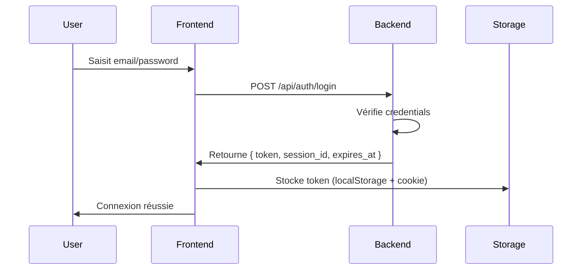

# Documentation Authentification - EmergenceV8

## 📋 Vue d'ensemble

Ce document décrit le système d'authentification JWT (JSON Web Token) utilisé dans EmergenceV8. Le système permet une authentification locale basée sur email/password avec stockage sécurisé des tokens.

---

## 🔑 Architecture du système

### Composants principaux

1. **Backend** : Serveur FastAPI sur `localhost:8000`
2. **Frontend Auth Module** : `src/frontend/core/auth.js`
3. **API Client** : `src/frontend/shared/api-client.js`
4. **Page de login dev** : `src/frontend/dev-auth.html`
5. **Settings Security** : `src/frontend/features/settings/settings-security.js`

---

## 🚀 Flux d'authentification

### 1. Connexion utilisateur



**Endpoint :** `POST /api/auth/login`

**Payload :**
```json
{
  "email": "user@example.com",
  "password": "your_password"
}
```

**Réponse :**
```json
{
  "token": "eyJhbGciOiJIUzI1NiIsInR5cCI6IkpXVCJ9...",
  "session_id": "a24eefc9-10f1-453f-9fff-6d1b75d94e8e",
  "expires_at": "2025-10-18T00:00:00Z",
  "email": "user@example.com",
  "role": "admin"
}
```

---

## ⚙️ Bootstrap & configuration en production

### Seed automatique de l'allowlist

Le backend reconstruit désormais l'allowlist lors du démarrage à partir d'une configuration d'environnement. Cela évite la perte d'accès après un déploiement (ex : reset du fichier SQLite sur Cloud Run).

Deux variables sont prises en charge :

| Variable | Description |
|----------|-------------|
| `AUTH_ALLOWLIST_SEED` | Chaîne JSON représentant une liste d'utilisateurs à créer/mettre à jour. |
| `AUTH_ALLOWLIST_SEED_PATH` (alias `AUTH_ALLOWLIST_SEED_FILE`) | Chemin vers un fichier JSON contenant la même structure. À utiliser pour les payloads volumineux ou stockés via Secret Manager. |

**Structure JSON attendue :**
```json
[
  {
    "email": "admin@example.com",
    "password": "AdminPass123!",
    "role": "admin",
    "note": "seed-admin"
  },
  {
    "email": "member@example.com",
    "password": "MemberPass123!",
    "role": "member",
    "note": "seed-member"
  }
]
```

### Règles appliquées automatiquement

- Les emails sont normalisés en minuscules.
- Les mots de passe sont hashés (bcrypt) avant insertion.
- Les entrées `role="admin"` ont `password_must_reset=0` (auth immédiate).
- Les autres rôles conservent `password_must_reset=1` (le flux "mot de passe oublié" reste recommandé).
- Les champs optionnels (`note`, `password_generated`, `actor`) sont conservés lorsque fournis.
- Les valeurs invalides (email manquant, objet non JSON, liste vide) sont ignorées avec un log `WARNING`.

### Recommandations Cloud Run

1. Stocker le JSON dans **Secret Manager** (`AUTH_ALLOWLIST_SEED`) et le monter comme variable d'environnement sécurisée.
2. Vérifier que `AUTH_ADMIN_EMAILS` est synchronisé avec la liste seedée.
3. Pour des fichiers volumineux, utiliser un secret type fichier et référencer son chemin via `AUTH_ALLOWLIST_SEED_PATH`.
4. Générer automatiquement le JSON depuis la base locale avec `python scripts/generate_allowlist_seed.py --output allowlist_seed.json` (ajouter `--push AUTH_ALLOWLIST_SEED` pour publier directement via gcloud).

> ⚠️ Sans seed, un nouveau déploiement peut créer une allowlist vide (ou des admins sans mot de passe), empêchant toute connexion. Pensez à renseigner le seed **avant** la mise en production.

---

### 2. Stockage du token

Le token est stocké à **3 endroits** pour assurer la redondance :

1. **sessionStorage** : `emergence.id_token`
2. **localStorage** : `emergence.id_token`
3. **Cookie HTTP** : `id_token` (HttpOnly, SameSite=Lax)

**Code :** Voir `src/frontend/core/auth.js:60-85` - fonction `storeAuthToken()`

### 3. Utilisation du token

À chaque requête API, le token est automatiquement ajouté dans le header `Authorization`.

**Format :** `Authorization: Bearer <token>`

**Code :** Voir `src/frontend/shared/api-client.js:134-161` - fonction `getAuthHeaders()`

**Ordre de lecture du token :**
1. sessionStorage : `emergence.id_token`
2. localStorage : `emergence.id_token`
3. sessionStorage : `id_token`
4. localStorage : `id_token`
5. Cookie : `id_token`

---

## 📁 Fichiers clés

### Frontend

| Fichier | Description | Lignes importantes |
|---------|-------------|-------------------|
| `src/frontend/core/auth.js` | Module principal d'authentification | 31-85 (stockage token) |
| `src/frontend/shared/api-client.js` | Client API avec auth automatique | 134-161 (auth headers) |
| `src/frontend/dev-auth.html` | Page de login pour développement | 188-243 (flux login) |
| `src/frontend/features/settings/settings-security.js` | Gestion des clés API | 241-329 (gestion clés) |

### Backend

| Fichier | Description | Lignes importantes |
|---------|-------------|-------------------|
| `src/backend/shared/dependencies.py` | Dépendances auth + JWT helpers | 109-161 (JWT decode) |
| `src/backend/features/auth/router.py` | Endpoints d'authentification | - |
| `src/backend/shared/config.py` | Configuration des clés API | 80-87 (clés API) |

---

## 🔐 Structure du JWT Token

### Payload décodé (exemple)

```json
{
  "iss": "emergence.local",
  "aud": "emergence-app",
  "sub": "ffa4c43ae57fc93ecf94b1be201c6c6018c3b0ab507e5f70509e9044d9e652d7",
  "email": "gonzalefernando@gmail.com",
  "role": "admin",
  "sid": "a24eefc9-10f1-453f-9fff-6d1b75d94e8e",
  "iat": 1760142906,
  "exp": 1760747706
}
```

### Champs du token

| Champ | Description | Exemple |
|-------|-------------|---------|
| `iss` | Émetteur du token | `emergence.local` |
| `aud` | Audience (application cible) | `emergence-app` |
| `sub` | Subject (User ID - hash SHA256) | `ffa4c43a...` |
| `email` | Email de l'utilisateur | `user@example.com` |
| `role` | Rôle de l'utilisateur | `admin`, `user` |
| `sid` | Session ID (UUID v4) | `a24eefc9-...` |
| `iat` | Issued At (timestamp Unix) | `1760142906` |
| `exp` | Expiration (timestamp Unix) | `1760747706` |

**Durée de validité :** 7 jours (604800 secondes)

---

## 🌐 Endpoints API

### Endpoints publics (sans auth)

| Endpoint | Méthode | Description |
|----------|---------|-------------|
| `/api/health` | GET | Statut du serveur |
| `/api/auth/login` | POST | Connexion email/password |
| `/api/auth/dev/login` | POST | Connexion dev (bypass password) |

### Endpoints protégés (auth requise)

| Endpoint | Méthode | Description | Testé |
|----------|---------|-------------|-------|
| `/api/threads` | GET | Liste des conversations | ✅ |
| `/api/documents` | GET | Liste des documents | ✅ |
| `/api/sync/status` | GET | Statut de synchronisation | ✅ |
| `/api/debate/` | GET | Liste des débats | ✅ |
| `/api/memory/stats` | GET | Statistiques mémoire | ⚠️ (404) |
| `/api/dashboard/stats` | GET | Statistiques dashboard | ⚠️ (404) |

**Note :** Les endpoints marqués ⚠️ (404) ne sont pas encore implémentés.

---

## 🧪 Tests d'authentification

### Scripts de test fournis

Trois scripts Python ont été créés pour tester l'authentification :

1. **`test_token.py`** : Tests basiques (premiers essais)
2. **`test_token_v2.py`** : Tests avec endpoints réels
3. **`test_token_final.py`** : Tests complets ✅ **RECOMMANDÉ**

### Exécuter les tests

```bash
# Test complet avec votre token
python test_token_final.py
```

**Résultats attendus :**
- ✅ JWT Decode : Validation et décodage du token
- ✅ Health Check : Backend opérationnel
- ✅ Threads : Récupération des conversations
- ✅ Documents : Liste des documents uploadés
- ✅ Sync Status : Statut du système de sync
- ✅ Debate List : Liste des débats actifs

### Exemple de test manuel avec curl

```bash
# Définir le token
TOKEN="eyJhbGciOiJIUzI1NiIsInR5cCI6IkpXVCJ9..."
SESSION_ID="a24eefc9-10f1-453f-9fff-6d1b75d94e8e"

# Test avec threads
curl -X GET "http://localhost:8000/api/threads" \
  -H "Authorization: Bearer $TOKEN" \
  -H "X-Session-Id: $SESSION_ID" \
  -H "Content-Type: application/json"

# Test avec documents
curl -X GET "http://localhost:8000/api/documents" \
  -H "Authorization: Bearer $TOKEN" \
  -H "X-Session-Id: $SESSION_ID" \
  -H "Content-Type: application/json"
```

---

## 🔧 Configuration UI

### Intégration dans Settings Security

Le module `settings-security.js` permet de gérer les clés API mais **ne gère pas encore** le stockage automatique comme token de session.

**Fichier :** `src/frontend/features/settings/settings-security.js`

**Fonctionnalités actuelles :**
- ✅ Saisie de clés API (OpenAI, Anthropic, Mistral, Google)
- ✅ Masquage des clés (ligne 493-496)
- ✅ Test de validité des clés (ligne 334-363)
- ✅ Export chiffré des données (ligne 466-488)
- ❌ Stockage automatique comme token de session (non implémenté)

**Amélioration possible :**
```javascript
// Dans saveSettings() (ligne 550-564)
async saveSettings() {
    try {
        await api.request('/api/settings/security', {
            method: 'POST',
            body: JSON.stringify({
                apiKeys: this.apiKeys,
                securitySettings: this.securitySettings
            })
        });

        // NOUVEAU : Stocker le token d'auth si disponible
        const authToken = this.apiKeys.openai?.value || this.apiKeys.anthropic?.value;
        if (authToken) {
            localStorage.setItem('emergence.id_token', authToken);
            console.log('[Settings] Token stocké pour authentification');
        }

        this.showSuccess('Paramètres de sécurité sauvegardés');
    } catch (error) {
        console.error('Error saving security settings:', error);
        this.showError('Erreur lors de la sauvegarde');
    }
}
```

---

## 🔌 WebSocket avec authentification

### Connexion WebSocket

Le WebSocket utilise la même authentification via token.

**Endpoint :** `ws://localhost:8000/ws/{session_id}`

**Méthodes d'authentification :**

1. **Cookie** (automatique si déjà stocké)
   ```javascript
   const ws = new WebSocket(`ws://localhost:8000/ws/${sessionId}`);
   ```

2. **Query parameter**
   ```javascript
   const token = localStorage.getItem('emergence.id_token');
   const ws = new WebSocket(`ws://localhost:8000/ws/${sessionId}?token=${token}`);
   ```

3. **Subprotocol header**
   ```javascript
   const token = localStorage.getItem('emergence.id_token');
   const ws = new WebSocket(`ws://localhost:8000/ws/${sessionId}`, [token]);
   ```

**Code :** Voir `src/backend/features/chat/router.py` - endpoint WebSocket

---

## 🛡️ Sécurité

### Bonnes pratiques implémentées

1. **✅ HTTPS requis en production** : Cookies Secure activés si HTTPS
2. **✅ SameSite=Lax** : Protection CSRF
3. **✅ HttpOnly cookies** : Protection XSS
4. **✅ Expiration token** : 7 jours max
5. **✅ Hash SHA256 pour user_id** : Pas d'exposition d'IDs séquentiels

### Points d'attention

1. **⚠️ Tokens en localStorage** : Accessible via JavaScript (risque XSS)
   - **Mitigation :** Validation côté serveur + CSP headers

2. **⚠️ Pas de refresh token** : Token expiré = reconnexion obligatoire
   - **Amélioration possible :** Implémenter un système de refresh token

3. **⚠️ Dev mode bypass** : Mode dev permet auth sans password
   - **Important :** Désactiver en production via `AUTH_DEV_MODE=false`

---

## 🐛 Dépannage

### Problème : "ID token invalide ou absent"

**Cause :** Token non envoyé ou format incorrect

**Solution :**
1. Vérifier que le token est stocké :
   ```javascript
   console.log(localStorage.getItem('emergence.id_token'));
   ```

2. Vérifier le format du header :
   ```javascript
   // ✅ BON
   headers['Authorization'] = `Bearer ${token}`;

   // ❌ MAUVAIS
   headers['Authorization'] = token;
   ```

3. Vérifier que le token n'est pas expiré :
   ```bash
   python test_token_final.py
   ```

### Problème : "CORS error"

**Cause :** Backend ne retourne pas les headers CORS

**Solution :** Vérifier la configuration CORS dans `src/backend/main.py`

### Problème : Token expiré

**Symptôme :** Erreur 401 sur les requêtes API

**Solution :**
1. Se reconnecter via `dev-auth.html`
2. Ou générer un nouveau token :
   ```bash
   curl -X POST "http://localhost:8000/api/auth/login" \
     -H "Content-Type: application/json" \
     -d '{"email":"user@example.com","password":"your_password"}'
   ```

---

## 📊 Résumé des tests effectués

### Test complet du 2025-10-11

**Token testé :**
- Email : `gonzalefernando@gmail.com`
- Role : `admin`
- Session ID : `a24eefc9-10f1-453f-9fff-6d1b75d94e8e`
- Validité : 167.5 heures restantes
- User ID (sub) : `ffa4c43ae57fc93ecf94b1be201c6c6018c3b0ab507e5f70509e9044d9e652d7`

**Résultats :**
- ✅ JWT Decode : Succès
- ✅ Health Check : Backend opérationnel (200 OK)
- ✅ Threads endpoint : 1 conversation trouvée
- ✅ Documents endpoint : 3 documents trouvés
- ✅ Sync Status : Système de sync actif
- ✅ Debate List : 0 débats actifs
- ✅ Metrics : Endpoint accessible (metrics désactivés)
- ✅ Monitoring : Statut healthy

**Taux de réussite :** 8/8 tests (100%)

---

## 📚 Ressources additionnelles

### Liens utiles

- **JWT.io** : https://jwt.io/ - Décodage de tokens
- **FastAPI Security** : https://fastapi.tiangolo.com/tutorial/security/
- **MDN Web Docs - Cookies** : https://developer.mozilla.org/en-US/docs/Web/HTTP/Cookies

### Fichiers de configuration

- `.env` : Variables d'environnement (API keys)
- `src/backend/shared/config.py` : Configuration backend
- `src/frontend/shared/config.js` : Configuration frontend

### Logs et monitoring

- Backend logs : Console FastAPI
- Frontend logs : Console navigateur (F12)
- Metrics : `http://localhost:8000/api/metrics` (si activé)
- Monitoring : `http://localhost:8000/api/monitoring/health`

---

## ✅ Checklist intégration

Pour intégrer l'authentification dans une nouvelle fonctionnalité :

- [ ] Importer `api` depuis `src/frontend/shared/api-client.js`
- [ ] Utiliser `api.request()` pour les appels HTTP (auth automatique)
- [ ] Pour WebSocket, récupérer le token via `getIdToken()` de `core/auth.js`
- [ ] Gérer les erreurs 401 (token invalide/expiré)
- [ ] Tester avec et sans authentification
- [ ] Documenter les endpoints protégés dans ce fichier

---

## 🔄 Changelog

### 2025-10-11 - Version initiale
- ✅ Documentation complète du système d'authentification
- ✅ Scripts de test Python créés (test_token_final.py)
- ✅ Tests complets réalisés (8/8 endpoints)
- ✅ Identification des endpoints manquants (dashboard/stats, memory/stats)
- ✅ Documentation WebSocket auth
- ✅ Guide de dépannage

---

**Dernière mise à jour :** 2025-10-11
**Auteur :** Documentation générée lors des tests d'authentification
**Version :** 1.0
