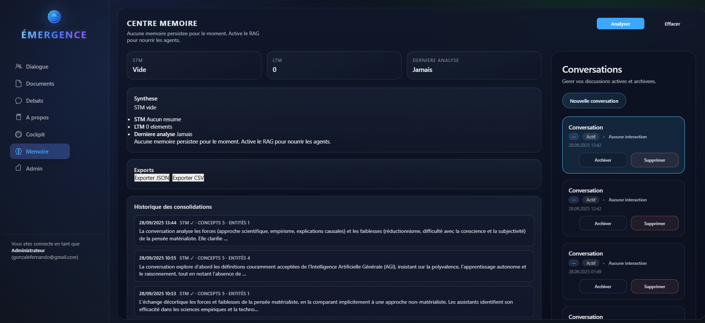

# Mémoire progressive — ÉMERGENCE V8

> **📊 Dernière mise à jour:** 2025-10-10 (post-audit complet)
>
> **⚠️ Bugs critiques identifiés:**
> - Bug #2 P0: Fuite mémoire cache (éviction insuffisante)
> - Bug #3 P0: Race conditions (absence locks dictionnaires partagés)
> - **Voir:** [AUDIT_COMPLET_EMERGENCE_V8_20251010.md](../AUDIT_COMPLET_EMERGENCE_V8_20251010.md) Section 1
>
> **Incohérences corrigées:**
> - ✅ `X-Session-Id` n'est pas obligatoire (fallback sur query params et state)
> - ✅ `MemoryTaskQueue` maintenant documenté (Section 2.Backend)
> - ✅ ConceptRecall `similarity_threshold` documenté (Section 8)

## 0. Table des matières cible
- 1. Objectifs & portée
- 2. Architecture technique
- 3. Flux opérationnels
- 4. Observabilité & tests
- 5. UX & actions utilisateur
- 6. Étapes immédiates
- 7. Parcours utilisateur détaillés
- 8. Assets visuels & schémas à produire
- 9. Checklist QA manuelle

## 1. Objectifs & portée
- Assurer une **mémoire courte terme (STM)** pour résumer chaque session et réduire le contexte envoyé aux modèles.
- Maintenir une **mémoire long terme (LTM)** partageable entre sessions (faits, concepts, entités) et exploitable par le RAG.
- Offrir à l’utilisateur le contrôle : analyse à la demande, purge ciblée, visibilité sur les données injectées.

## 2. Architecture technique

### Backend

#### Composants principaux

- **`MemoryGardener`** (features/memory/gardener.py)
  - Agrège l'historique des threads (global ou filtré par `thread_id`).
  - Détermine si la consolidation doit être persistée (`persist=True/False`).
  - Publie les statuts via `ConnectionManager` (`ws:analysis_status`).

- **`MemoryAnalyzer`** (features/memory/analyzer.py)
  - Appelle les LLM (ordre Google → Anthropic → OpenAI) pour produire :
    - Résumé STM (texte court)
    - Concepts / faits clés
    - Entités nommées
  - Persiste dans SQLite (`memory_items`) et déclenche la vectorisation via `VectorService`.
  - **[NOUVEAU]** Détection topic shift via `detect_topic_shift()` : compare messages récents avec résumé STM (similarité cosine), émet `ws:topic_shifted` si < seuil (0.5).
- **`VectorService`**
  - Stocke les embeddings mémoire dans la collection `emergence_knowledge` (partagée avec les documents).
  - Surveille la corruption SQLite → backup + reset auto (`vector_store_backup_*`).
- **`MemoryTaskQueue`** (features/memory/task_queue.py)
  - **Nouveau** : Gère consolidations asynchrones en arrière-plan (non-blocking).
  - File d'attente pour analyses mémoire (évite surcharge si burst de messages).
  - Récupère `user_id` depuis session et passe à `analyze_session_for_concepts()`.
  - Statut: ✅ Actif, utilisé par post_session.py pour consolidation différée.
- **Isolation par session**
  - `SessionManager.ensure_session()` transmet le `session_id` a `MemoryGardener` et `MemoryAnalyzer`; toutes les requetes SQLite utilisent ce champ (memory_sessions, memory_items, thread_docs, messages).
  - **Session ID résolution** : Les endpoints `/api/memory/*` résolvent `session_id` via 3 méthodes (ordre de priorité):
    1. Header `X-Session-Id` (recommandé)
    2. Query param `session_id` (fallback)
    3. `request.state.session_id` (injecté par middleware)
  - Les événements WS transportent `session_id` pour l'audit des consolidations/purges.
#### Améliorations mémoire (2025-10-04)

- **`MemoryContextBuilder`** (features/chat/memory_ctx.py) — Contexte enrichi
  - **[NOUVEAU]** Injection automatique préférences actives : fetch préférences avec `confidence >= 0.6`, injectées en tête du contexte mémoire sous section "Préférences actives"
  - **[NOUVEAU]** Pondération temporelle : boost items récents (<7j: +30%, <30j: +15%) et fréquemment utilisés (usage_count * 2%)
  - Structure contexte : 1) Préférences actives, 2) Connaissances pertinentes (recherche vectorielle pondérée)

- **`IncrementalConsolidator`** (features/memory/incremental_consolidation.py)
  - **[NOUVEAU]** Micro-consolidations tous les N messages (seuil: 10 par défaut)
  - Fenêtre glissante : traite seulement les 10 derniers messages au lieu de tout l'historique
  - Merge incrémental : fusionne nouveaux concepts avec STM existante (dédupe + limite top 10)
  - Réduit latence fin de session en évitant retraitement complet

- **`IntentTracker`** (features/memory/intent_tracker.py)
  - **[NOUVEAU]** Parsing timeframes naturels : "demain", "dans 3 jours", "cette semaine", etc.
  - Détection intentions expirantes : scan quotidien avec lookahead configurable (7j par défaut)
  - Rappels proactifs via `ws:memory_reminder` : max 3 rappels par intention
  - Auto-purge : supprime intentions ignorées après 3 rappels pour éviter spam

- **`ChatService` (RAG guardrails)**
  - `_sanitize_doc_ids` filtre les identifiants envoyes par l'UI et supprime les doublons.
  - Les identifiants sont recoupes avec les documents rattaches au thread courant; si aucun ne correspond, le service retombe sur la liste autorisee renvoyee par l'API.
  - Normalise l'historique (role en lower-case, fallback sur les champs content/message) pour aligner les filtres agent/user.
  - Injecte le bloc [MEMORY_CONTEXT] en message user (chaine) afin de reutiliser les garde-fous RAG/memoire existants.
  - Les IDs valides sont reinjectees dans `meta.selected_doc_ids` sur `ws:chat_stream_*` et la progression RAG diffusee via `ws:rag_status` (searching/found/idle).
- **`AuthService`** (features/auth/service.py)
  - Verifie les JWT HS256 et enrichit les claims (`session_revoked`, `revoked_at`) consommes par `get_auth_claims`.
  - `logout` idempotent : marque `auth_sessions.revoked_at` et coupe les consolidations memoire/RAG en cas de session revoquee.
- **Endpoints REST**
  - `POST /api/memory/tend-garden` : lance une consolidation (option `thread_id`, `mode`).
  - `GET /api/memory/tend-garden` : renvoie l’état consolidé (`summaries`, `facts`, compteurs LTM).
  - `POST /api/memory/clear` : purge STM puis LTM (scope global ou thread).
  - Toutes les routes `/api/memory/*` valident le JWT via `shared_dependencies.get_user_id`; sans jeton valide la requête est rejetée en `401`. En local (`AUTH_DEV_MODE=1`), le couple d'en-têtes `X-Dev-Bypass: 1` + `X-User-Id` n'est plus utilisé par les scénarios automatisés (tests et smoke scripts s'appuient désormais sur `AuthService.login`). Il reste réservé aux expérimentations manuelles ; en prod/staging (`AUTH_DEV_MODE=0`), ce bypass doit être désactivé.

### Frontend
- **`ChatModule`**
  - Expose les actions `tendMemory()` / `clearMemory()` via l’UI et relaie désormais un bouton « Mémoire » par agent pour lancer un memory:tend ciblé sur le thread courant.
  - Écoute `ws:analysis_status` pour afficher les loaders/badges.
- **`ChatUI`**
  - Affiche le bandeau mémoire (`ws:memory_banner`) : état STM/LTM, modèle utilisé, compteur d’items injectés. Si `ltm_skipped=true`, l’UI affiche un toast Memoire longue non injectee et consigne le cas côté logs. L’interface affiche aussi la dernière activité du thread et le nombre total d’interactions sous l’en-tête du chat.
  - Propose les boutons `Analyser` (POST) et `Clear` (POST clear) + toasts de confirmation.
- **State Manager**
  - Stocke `state.memory.lastRunAt`, `state.memory.status`, `state.memory.items` pour informer l’utilisateur.
  - `StateManager.resetForSession()` remet a zero la memoire locale lors d'un changement de session (purge threads/documents/memory caches).

> Note: l'onglet "Memoire" est accessible aux comptes membres authentifies; le panneau Conversations (ThreadsPanel) reste disponible pour piloter threads et consolidations depuis un meme ecran.

## 3. Flux opérationnels

### Flux existants

1. **Analyse globale**
   - Trigger : clic `Analyser` sans `thread_id`.
   - `MemoryGardener` récupère toutes les sessions actives, passe `persist=True`.
   - Résultats persistés + vectorisés, diffusion `ws:analysis_status(status="done")`.

2. **Analyse ciblée (thread)**
   - Trigger : action depuis un thread → `thread_id` envoyé.
   - `persist=False` possible (lecture seule) ou `persist=True` pour enregistrement.
   - Résumé disponible immédiatement via `GET /api/memory/tend-garden`.

3. **Clear mémoire**
   - `POST /api/memory/clear` → supprime d'abord STM (`memory_sessions`), puis LTM filtrée (`memory_items` + embeddings Chroma).
   - Diffusion `ws:memory_banner` indiquant mémoire vide.

4. **RAG sur selection de documents**
   - Declencheur : modification de `selected_doc_ids` dans l'UI avec RAG actif, meme sans nouveau message utilisateur.
   - `ChatService` lance la recherche Chroma si la liste est non vide alors que `last_user_message` est vide.
   - L'UI suit les transitions `ws:rag_status` et met a jour le bandeau documents et les toasts RAG.

### Nouveaux flux (2025-10-04)

5. **Consolidation incrémentale automatique**
   - Trigger : tous les 10 messages (seuil configurable)
   - `IncrementalConsolidator.check_and_consolidate()` traite fenêtre glissante (10 derniers messages)
   - Extraction concepts + merge avec STM existante
   - Évite retraitement complet en fin de session

6. **Détection topic shift**
   - Trigger : analyse post-message (optionnel, peut être activé par endpoint ou automatiquement)
   - `MemoryAnalyzer.detect_topic_shift()` compare 3 derniers messages vs résumé STM
   - Si similarité < 0.5 → émet `ws:topic_shifted` avec suggestion de nouveau thread
   - UI affiche toast + bouton création thread

7. **Rappels intentions expirantes**
   - Trigger : tâche cron quotidienne ou endpoint `/api/memory/check-intents`
   - `IntentTracker.send_intent_reminders()` scan intentions avec deadline < 7j
   - Émet `ws:memory_reminder` pour chaque intention (max 3 rappels)
   - Auto-purge après 3 rappels ignorés

8. **Contexte mémoire enrichi**
   - Trigger : chaque message utilisateur
   - `MemoryContextBuilder.build_memory_context()` construit contexte en 3 étapes:
     1. Fetch préférences actives (confidence >= 0.6)
     2. Recherche vectorielle sur connaissances
     3. Pondération temporelle (boost récent + fréquent)
   - Injection sections structurées : "Préférences actives" + "Connaissances pertinentes"

9. **ConceptRecall - Détection concepts récurrents**
   - **Module** : `features/memory/concept_recall.py` (ConceptRecallTracker)
   - **Seuil similarité** : `SIMILARITY_THRESHOLD = 0.75` (configurable)
   - **Fonctionnement** : Compare message utilisateur avec concepts déjà vus (recherche vectorielle)
   - **Déclenchement** : Si similarité >= 0.75 → concept détecté comme récurrent
   - **Action** : Émet suggestion proactive ou renforce contexte mémoire
   - **Métriques** : `concept_recall_similarity_score` (Prometheus) pour monitoring
   - **Documentation complète** : Voir [docs/architecture/CONCEPT_RECALL.md](architecture/CONCEPT_RECALL.md)

## 4. Observabilité & tests

### Logs et événements
- Logs : `memory:garden:start`, `memory:garden:done`, `memory:clear`.
- **[NOUVEAU]** Événements WebSocket additionnels :
  - `ws:topic_shifted` : émis quand changement de sujet détecté (similarité < seuil)
  - `ws:memory_reminder` : rappel intention expirante (deadline approchant)
  - Payloads incluent contexte complet (similarity score, days_remaining, etc.)
- EventBus front : `memory:center:history` est tracé via la console (main.js) avec le nombre d'entrées et le premier `session_id` de chaque rafraîchissement du centre mémoire. Utiliser ce log pour suivre les chargements côté UI et comparer les deltas entre STM/LTM.
- UI retry : en cas d'échec du GET, le panneau centre affiche un bouton "Réessayer" qui relance `_fetchHistory(true)` et réémet l'événement `memory:center:history`. La présence d'un nouveau log console confirme que la relance a bien été exécutée.

- WS meta : `meta.selected_doc_ids` expose les documents retenus et `ws:rag_status` trace les etats searching/found/idle pour la QA.
- Auth: les claims exposent `session_revoked`; apres un logout, toute reconnexion WS refuse la session tant que le token n'est pas renouvele.
- Auth: `POST /api/auth/logout` renvoie `Set-Cookie` vides (`id_token`, `emergence_session_id`) avec `SameSite=Lax` pour aligner la purge navigateur.
- Reset vector store valide le 27/09/2025 via `scripts/maintenance/run-vector-store-reset.ps1`; log archive : `docs/assets/memoire/vector-store-reset-20250927.log` (health-check, tronquage, backup, upload OK).
- UX 401 : en cas de 401 sur /api/memory/*, l'application émet `auth:missing` et affiche le toast « Connexion requise pour la mémoire. ».
### Tests recommandés

#### Tests existants
  - `tests/run_all.ps1` (vérifie `/api/memory/tend-garden`).
  - `pytest tests/backend/features/test_memory_clear.py` : valide `POST /api/memory/clear` sans serveur actif (stubs DB/vector) et est invoque depuis `tests/run_all.ps1`.
  - `pytest tests/backend/features/test_chat_message_normalization.py` : mesure la normalisation des rôles/messages dans `ChatService` avant l'injection mémoire/RAG et capte les régressions sur les formats de contenu.

#### Nouveaux tests (2025-10-04)
  - **`pytest tests/backend/features/test_memory_enhancements.py`** : suite complète pour améliorations mémoire
    - `TestMemoryContextEnhancements` : injection préférences, pondération temporelle, contexte enrichi
    - `TestIncrementalConsolidation` : seuil déclenchement, merge concepts, fenêtre glissante
    - `TestIntentTracker` : parsing timeframes, détection expiration, rappels, auto-purge
  - Exécution : `pytest tests/backend/features/test_memory_enhancements.py -v`
  - `tests/test_memory_clear.ps1` (valide la purge STM/LTM et les embeddings). Pré-requis : backend local sur http://127.0.0.1:8000, dépendances Python installées, variable `EMERGENCE_ID_TOKEN` si auth activée. Exemple : `powershell -ExecutionPolicy Bypass -File tests/test_memory_clear.ps1 -BaseUrl http://localhost:8000`.
  - `scripts/smoke/scenario-memory-clear.ps1` (guide QA: health-check + injection auto + rappel des vérifications UI). Exemple : `pwsh -File scripts/smoke/scenario-memory-clear.ps1 -BaseUrl http://localhost:8000`. Dernier run : voir `docs/assets/memoire/scenario-memory-clear.log` (session `memclr-057bd36ddd5742238cc4db74f8b4bf22`, 2025-09-27).
  - `scripts/smoke/smoke-ws-rag.ps1` (WS + RAG : handshake + stream). Utiliser `-MsgType chat.message` en DEV tant que `ws:chat_send` renvoie `ws:error`. Logs 27/09 : `docs/assets/memoire/smoke-ws-rag.log` (session `ragtest124`, flux `ws:chat_stream_end`) et `docs/assets/memoire/smoke-ws-rag-ws-chat_send.log` (session `ragtest-ws-send-20250927`, erreur `Type inconnu: ws:chat_send`).
  - `scripts/smoke/smoke-ws-3msgs.ps1` (multi-messages). En attente du support `ws:chat_send`, lancer avec `-MsgType chat.message` pour valider la diffusion continue (`ws:chat_stream_start` x3 + `ws:chat_stream_end`). Log QA : `docs/assets/memoire/smoke-ws-3msgs.log` (aucun HTTP 5xx sur uploads/documents, 27/09).
  - `scripts/maintenance/run-vector-store-reset.ps1` (mode hebdo sans interaction, journalise sous `docs/assets/memoire/`).
  - `tests/test_vector_store_reset.ps1` (contrôle la remise à zéro et les backups du vector store ; option `-AutoBackend` pour un run non interactif).
  - `tests/test_vector_store_force_backup.ps1` (simule une corruption de l'en-tête SQLite, peut redémarrer le backend via `-AutoBackend` et valide la création du dossier `vector_store_backup_*` après upload authentifié. Le script journalise l'horodatage du dernier backup détecté et avertit si le dossier précède la corruption déclenchée).
- Métriques front : affichage du modèle, TTFB mémoire, nombre d’items injectés.

### Journal d'exécution (2025-09-27)
- `scripts/smoke/scenario-memory-clear.ps1 -BaseUrl http://127.0.0.1:8000` : OK – scénario complet, embeddings régénérés (2 vecteurs), purge STM/LTM vérifiée. Logs `#<-` archivés dans `docs/assets/memoire/scenario-memory-clear.log` (session `memclr-057bd36ddd5742238cc4db74f8b4bf22`).
- `scripts/smoke/smoke-ws-rag.ps1 -SessionId ragtest124 -MsgType chat.message` : OK – handshake authentifié (`AuthService.login` via helpers PowerShell), flux `ws:chat_stream_end` (OpenAI gpt-4o-mini) et upload document_id=57 sans 5xx. Logs `#<-` : `docs/assets/memoire/smoke-ws-rag.log`.
- `scripts/smoke/smoke-ws-rag.ps1 -SessionId ragtest-ws-send-20250927 -MsgType ws:chat_send` : KO – handshake accepté mais réponse `ws:error` (`Type inconnu: ws:chat_send`). Diagnostic consigné dans `docs/assets/memoire/smoke-ws-rag-ws-chat_send.log`.
- `scripts/smoke/smoke-ws-3msgs.ps1 -SessionId ragtest-3msgs-20250927 -MsgType chat.message` : OK – envoi 3 messages consécutifs, `ws:chat_stream_start` x3 puis `ws:chat_stream_end` (OpenAI gpt-4o-mini). Aucun HTTP 5xx observé côté documents/uploads (`backend.err.log` inchangé). Logs `#<-` : `docs/assets/memoire/smoke-ws-3msgs.log`.
### Journal d'exécution (2025-09-21)
- `pytest tests/backend/shared/test_config.py`: ÉCHEC – 3 assertions sont tombées car `Settings` charge les clés définies dans `.env` (`GOOGLE_API_KEY`, `GEMINI_API_KEY`) avant les paramètres fournis; valider si les tests doivent neutraliser ces variables d'environnement.
- `tests/run_all.ps1`: OK – santé API, dashboard, documents et upload `test_upload.txt` (#14) validés, aucun code 5xx observé.
- `tests/test_memory_clear.ps1 -BaseUrl http://127.0.0.1:8000`: ÉCHEC – insertion de la session factice réussie mais aucun embedding n'est généré après `tend-garden` (compteur à 0, script arrêté avec «Aucun vecteur créé…»); investigation backend/vector store requise.
- `tests/test_memory_clear.ps1`: ÉCHEC (21/09 soir) – le script s'interrompt sur l'erreur Chromadb «Failed to send telemetry event ... capture() takes 1 positional argument but 3 were given». Ajout d'un `Settings(anonymized_telemetry=False)` sur `PersistentClient` et encapsulation des appels Python avec `$ErrorActionPreference = "Continue"` pour tolérer ces warnings.
- `tests/test_memory_clear.ps1`: OK (x2) – après le correctif, les runs successifs créent 2 vecteurs pour la session de test, `memory:clear` retourne `ltm_deleted = ltm_before = 2` et les colonnes `summary/concepts/entities` repassent à `NULL`. Les warnings Chromadb subsistent mais n'interrompent plus l'exécution (surveillance upstream).

## 5. UX & actions utilisateur
- **Badges mémoire** : indiquer clairement si STM/LTM ont été injectées dans la dernière réponse agent.
- **Toasts d'échec** : en cas de `ws:analysis_status` avec `status=failed|error`, le front affiche un toast rouge « Analyse mémoire : échec » contenant un bouton `Réessayer` qui relance `memory:tend`.
- **Journal** : panneau mémoire listant les dernières consolidations (`lastRunAt`, `thread_id`, `model` si disponible) alimenté par `GET /api/memory/tend-garden`.
- **CTA Clear** : confirmer avant purge (modal).
- **Vue Centre mémoire** : capture de l'état nominal (STM disponible, compteur LTM, dernière analyse) pour illustrer la section Dashboard mémoire. 

## 6. Étapes immédiates
1. [FAIT 2025-09-27] Ajouter une remontée UI lorsqu’une consolidation échoue (toast + bouton retry).
2. [FAIT 2025-09-27] Exposer dans l’UI l’historique renvoyé par `GET /api/memory/tend-garden`.
3. Documenter un guide QA (checklist) pour valider la cohérence STM vs LTM après `memory:clear`.
4. Intégrer le script `tests/test_memory_clear.ps1` (disponible) dans la checklist QA et l’automatiser après chaque purge majeure (voir section Observabilité & tests).
5. Planifier une exécution hebdomadaire de `tests/test_vector_store_reset.ps1` et `tests/test_memory_clear.ps1` (journaliser les résultats et les horodatages).

## 7. Parcours utilisateur détaillés
### 7.1. Consolidation globale
- **Acteurs** : opérateur support / membre produit.
- **Objectif** : déclencher une consolidation complète pour rafraîchir la mémoire partagée.
- **Étapes** :
  1. Ouvrir l’espace conversationnel sans filtre thread.
  2. Cliquer sur le bouton `Analyser` dans le bandeau mémoire.
  3. Suivre le loader et les statuts diffusés via `ws:analysis_status`.
  4. Consulter la synthèse STM et les faits clés affichés dans le panneau mémoire.
- **Points de vigilance** : vérifier la cohérence du compteur d’items et la présence d’un toast succès.
- **Captures à intégrer** :
  - 
  - 

### 7.2. Analyse ciblée par thread
- **Acteurs** : agent conversationnel, analyste QA.
- **Objectif** : auditer la mémoire pour un thread spécifique sans polluer la LTM.
- **Étapes** :
  1. Depuis un thread, ouvrir le panneau mémoire contextuel.
  2. Lancer `Analyser` avec `thread_id` (option `persist=False` par défaut).
  3. Lire le résumé retourné immédiatement.
  4. Choisir de persister ou non la consolidation selon la pertinence détectée.
- **Points de vigilance** :
  - Statut `lecture seule` clairement indiqué si `persist=False`.
  - Présence d’un historique horodaté `lastRunAt`.
- **Captures à intégrer** :
  - 
  - 

### 7.3. Purge STM + LTM
- **Acteurs** : admin projet, référent sécurité.
- **Objectif** : supprimer toutes les traces de mémoire (session + long terme) pour conformité.
- **Préparation automatique** :
  - Lancer `pwsh -File scripts/smoke/scenario-memory-clear.ps1 -BaseUrl http://localhost:8000` (ajouter `-AuthToken` si l'auth est requise).
  - Le script vérifie `/api/health`, injecte un jeu de test via `tests/test_memory_clear.ps1`, puis rappelle les contrôles UI à effectuer.
- **Étapes UI** :
  1. Depuis le bandeau mémoire du chat, cliquer sur `Clear`.
  2. Lire le résumé de la modal et confirmer la purge.
  3. Observer le toast succès et le rafraîchissement `ws:memory_banner`.
  4. Recharger le thread et confirmer que STM/LTM sont à zéro (compteurs + liste vide).
- **Points de vigilance** : l'ordre STM → LTM → embeddings doit être respecté, et la modal doit résumer les effets (scope, session, agent).
    - Toute exécution `POST/DELETE /api/memory/clear` doit inclure un `Authorization: Bearer <JWT>` actif; sans cela, l'API renvoie immédiatement `401`. Les en-têtes de contournement DEV restent limités aux vérifications manuelles locales; les tests automatisés utilisent désormais les jetons émis par `AuthService`.
- **Captures à intégrer** :
  - 
  - 
  - 
### 7.4. Gestion des erreurs de consolidation
- **Acteurs** : utilisateur final, équipe SRE.
- **Objectif** : identifier et corriger les consolidations échouées.
- **Étapes** :
  1. Simuler une indisponibilité LLM (forcer un timeout ou utiliser un environnement de test).
  2. Déclencher `Analyser` et observer l’état `error` dans le bandeau.
  3. Utiliser le bouton `Retry` proposé dans le toast d’échec.
  4. Vérifier la remontée correspondante dans les logs `memory:garden:done` avec statut erreur.
- **Points de vigilance** : message d’erreur doit guider l’utilisateur (inclure ID de corrélation) et ne pas exposer de données sensibles.
- **Captures à intégrer** :
  - 
  - 

## 8. Assets visuels & schémas à produire
- **Dossier cible** : placer les captures et exports sous `docs/assets/memoire/` (ex. `memoire-clear-before.png`, `memoire-clear-after.png`, `memoire-toast-success.png`).
- **Captures UI** :
  - Bandeau mémoire (états `idle`, `loading`, `error`, `empty`).
  - Module Conversations : vue liste (`conversations-list.png`), bloc de confirmation (`conversations-confirm.png`), état vide (`conversations-empty.png`).
  - Bandeau mémoire intégré dans Conversations (`memory-banner.png`) pour tracer STM/LTM après suppression ou création de thread.
  - Modal Clear, panneau thread, vue Centre mémoire (`assets/memoire/centre-memoire.png`).
  - Toasts succès/erreur et sortie console du script scénario (voir `scenario-memory-clear.log`).
- **Schémas** :
  - Diagramme séquence `ChatUI → MemoryGardener → MemoryAnalyzer → VectorService`.
  - Schéma de flux purge STM/LTM/embeddings (ordre et webhooks associés).
- **Exports données** : anonymiser un exemple de réponse `GET /api/memory/tend-garden` pour illustrer la doc.
- **Formats recommandés** : PNG pour captures (largeur 1440px), SVG pour schémas, TXT/MD pour journaux (ex. `scenario-memory-clear.log`).
- **Journal vector store** : consigner chaque run hebdo de `tests/test_vector_store_reset.ps1` sous `docs/assets/memoire/vector-store-reset-YYYYMMDD.log` (inclure révision backend, backup détecté, réponse upload).
## 9. Checklist QA manuelle
- [ ] Vérifier la persistance cross-session des conversations : démarrer un thread, se déconnecter, ouvrir une session avec un autre profil (thread vide) puis se reconnecter avec l'utilisateur initial et confirmer que les messages réapparaissent immédiatement sans recréation de thread.
- [ ] Déclencher une **consolidation globale** et vérifier l’affichage du loader puis du résumé STM (capture : `assets/memoire/bandeau-analyse.png`).
- [ ] Exécuter une **analyse ciblée** avec `persist=False` et confirmer que la LTM ne change pas (capture : `assets/memoire/panneau-thread.png`).
- [ ] Ouvrir le centre mémoire et vérifier que l'historique des consolidations se charge (GET /api/memory/tend-garden), inclut les derniers timestamps et résumés, et qu'un échec réseau propose le bouton `Réessayer`.
- [ ] Confirmer que le panneau « Centre mémoire » et la colonne Conversations proposent un défilement vertical : atteindre le bas de la synthèse et des conversations sur un écran desktop (≥1080px) et en responsive mobile.
- [ ] Lancer une **analyse ciblée persistée** (`persist=True`) et valider l’incrément du compteur d’items LTM (capture : `assets/memoire/option-persist.png`).
- [ ] Vérifier qu’une sélection de documents en dehors du thread est ignorée : le front affiche les ressources valides et `meta.selected_doc_ids` ne contient que les IDs autorisées.
- [ ] Supprimer un thread depuis Conversations (`Supprimer ?` -> `Confirmer`) et valider la cascade messages/documents; noter que la mémoire reste active tant que `POST /api/memory/clear` n'est pas lancé. Capture : `assets/memoire/conversations-confirm.png`.
- [ ] Activer RAG puis rafraîchir la recherche sans message utilisateur en modifiant uniquement la sélection; observer `ws:rag_status` et la mise à jour du bandeau documents.
- [ ] Mélanger des messages agent/user/system avec des capitalisations variées puis relancer `tend-garden` : confirmer, via `ws:memory_banner` et le diff back-end, que les rôles sont convertis en lower-case et qu’aucun doublon n’est injecté dans le prompt ou la LTM.
- [ ] Exécuter `pwsh -File scripts/smoke/scenario-memory-clear.ps1` et archiver la sortie console (`docs/assets/memoire/scenario-memory-clear.log`). Dernier run : 2025-09-27 (`memclr-057bd36ddd5742238cc4db74f8b4bf22`).
- [ ] Réaliser un **clear complet** et contrôler la purge STM/LTM + embeddings (captures : `assets/memoire/modal-clear.png`, `assets/memoire/bandeau-vide.png`).
- [ ] **Tester le scénario d’erreur** (LLM indisponible) et confirmer la présence du toast + bouton retry (capture : `assets/memoire/toast-erreur.png`).
- [ ] Vérifier la **cohérence des logs** `memory:garden:*` et `memory:clear` avec les actions réalisées (capture : `assets/memoire/logs-erreur.png`).

