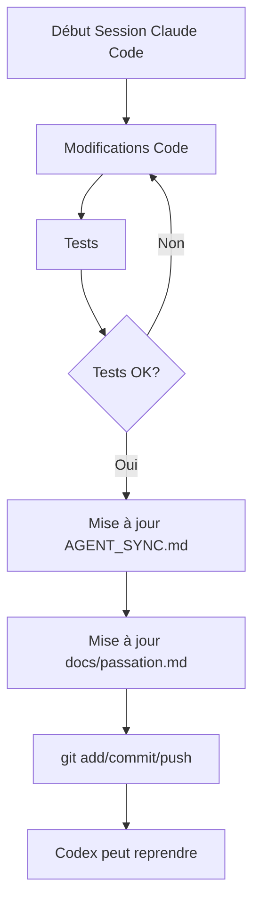

# 📚 Système de Documentation Collaborative - Emergence V8

## 🎯 Objectif

Garantir que **Claude Code** et **Codex GPT** puissent collaborer efficacement en maintenant une documentation synchronisée après chaque session de modifications.

## 🔄 Routine Intégrée

La routine de synchronisation documentation est maintenant **intégrée** dans les instructions de Claude Code :

### Fichiers Configurés

1. **`.claude/instructions/style-fr-cash.md`**
   - Section "🔄 Routine Documentation" ajoutée
   - Rappel systématique de la commande
   - Conditions de skip définies

2. **`.claude/instructions/doc-sync-routine.md`** (NOUVEAU)
   - Guide complet de la routine
   - Checklist détaillée
   - Format standardisé des entrées
   - Exemples types

3. **`AGENTS.md`**
   - Section "Clôture de session" mise à jour
   - Documentation collaborative marquée OBLIGATOIRE
   - Référence au guide détaillé

4. **`.git/hooks/pre-commit-docs-reminder.ps1`** (NOUVEAU)
   - Hook Git optionnel pour rappel avant commit
   - Détection automatique des fichiers modifiés
   - Prompt interactif

## 📝 Commande Magique

Après chaque session de modifications, Claude Code doit exécuter :

```
Mets à jour AGENT_SYNC.md et docs/passation.md avec les changements de cette session
```

## 📂 Fichiers Mis à Jour Automatiquement

### 1. AGENT_SYNC.md (racine)

**Sections à actualiser** :
- `Dernière mise à jour` : Timestamp au format `YYYY-MM-DD HH:MM CEST`
- `Zones de travail en cours` → `Claude Code (moi)` :
  - Statut de la session
  - Liste des actions réalisées
  - Fichiers touchés
  - Changements clés
  - Tests effectués
  - Prochaines actions

### 2. docs/passation.md

**Format d'entrée** (en haut du fichier) :

```markdown
## [YYYY-MM-DD HH:MM] - Agent: Claude Code (Description courte)

### Fichiers modifiés
- path/to/file1.ext
- path/to/file2.ext

### Contexte
- Pourquoi ces changements
- Problème résolu

### Actions réalisées
1. **Action 1** : Détails
2. **Action 2** : Détails

### Tests
- ✅ Test réussi
- ⏳ Test à relancer
- ❌ Test échoué (si applicable)

### Résultats
- Impact mesurable
- Améliorations apportées

### Prochaines actions recommandées
1. Action pour Codex
2. Tests à valider

### Blocages
- Aucun (ou détailler)
```

## ✅ Quand Utiliser la Routine

**Tu DOIS mettre à jour la doc après :**
- ✅ Modifications code frontend (`src/frontend/`)
- ✅ Modifications code backend (`src/backend/`)
- ✅ Changements de styles CSS
- ✅ Configuration (`package.json`, `requirements.txt`)
- ✅ Architecture/structure
- ✅ Déploiements

**Tu PEUX skip si :**
- ❌ Simple lecture/analyse de code
- ❌ Réponses aux questions sans modification
- ❌ Recherche de bugs sans fix

## 🔧 Activation du Hook Git (Optionnel)

Pour activer le rappel automatique avant commit :

### Windows (PowerShell)
```powershell
# Copier le hook
Copy-Item .git/hooks/pre-commit-docs-reminder.ps1 .git/hooks/pre-commit

# Rendre exécutable (Git Bash)
chmod +x .git/hooks/pre-commit
```

### Unix/Mac
```bash
# Créer le hook
cp .git/hooks/pre-commit-docs-reminder.ps1 .git/hooks/pre-commit

# Rendre exécutable
chmod +x .git/hooks/pre-commit
```

## 📊 Bénéfices

1. **Collaboration fluide** : Codex sait exactement où reprendre
2. **Historique complet** : Traçabilité de tous les changements
3. **Évite les conflits** : Chaque agent connaît l'état actuel
4. **Gain de temps** : Pas besoin de re-contextualiser
5. **Qualité** : Documentation toujours à jour

## 🚀 Workflow Complet



## 📞 Support

**Questions ?** Référence complète :
- `.claude/instructions/doc-sync-routine.md`
- `AGENTS.md` (section "Clôture de session")

---

**Cette routine est maintenant intégrée aux instructions de Claude Code** ✨

Dernière mise à jour : 2025-10-07 06:45 CEST
