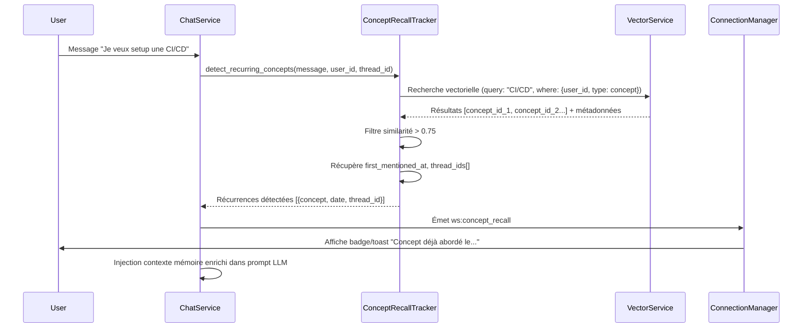

# Détection et Rappel de Concepts Récurrents — ÉMERGENCE V8

**Version** : 1.0
**Date** : 2025-10-04
**Auteur** : Claude Code
**Statut** : Proposition technique — Validation FG requise

---

## 0. Table des matières

- [1. Objectifs](#1-objectifs)
- [2. État des lieux](#2-état-des-lieux)
- [3. Architecture proposée](#3-architecture-proposée)
- [4. Implémentation technique](#4-implémentation-technique)
- [5. Contrats API & événements](#5-contrats-api--événements)
- [6. Plan de déploiement](#6-plan-de-déploiement)
- [7. Tests & validation](#7-tests--validation)
- [8. Checklist de livraison](#8-checklist-de-livraison)

---

## 1. Objectifs

### 1.1. Besoin utilisateur

**Demande initiale** : L'utilisateur souhaite que les agents puissent :
- **Détecter automatiquement** quand un sujet/concept a déjà été abordé dans l'historique
- **Signaler spontanément** ces récurrences pendant la conversation
- **Fournir le contexte précis** : date, heure, thread concerné et liens conceptuels

### 1.2. Cas d'usage

1. **Rappel proactif en conversation**
   ```
   USER: Je voudrais mettre en place une CI/CD pour le projet
   AGENT: 🔗 Nous avons déjà abordé la CI/CD le 2 octobre 2025 à 14:32
          (thread: "Infrastructure DevOps"). Je peux m'appuyer sur
          ces échanges précédents pour approfondir.
   ```

2. **Question explicite de l'utilisateur**
   ```
   USER: Est-ce qu'on a déjà parlé de containerisation ?
   AGENT: ✅ Oui, 3 fois :
          - 28 sept 2025, 10:15 — Thread "Migration Docker" (concepts: Docker, Kubernetes)
          - 1 oct 2025, 16:42 — Thread "Débat architecture" (concepts: microservices)
          - 3 oct 2025, 09:20 — Thread actuel (concepts: CI/CD pipeline)
   ```

3. **Détection de redondance**
   ```
   AGENT: 💡 Je remarque que nous revenons sur le sujet "optimisation
          mémoire" déjà exploré le 15 septembre 2025 à 11:05.
          Souhaitez-vous que je reprenne les conclusions précédentes ?
   ```

---

## 2. État des lieux

### 2.1. Infrastructure existante

#### ✅ **Composants disponibles**

1. **MemoryAnalyzer** ([analyzer.py:52-236](src/backend/features/memory/analyzer.py#L52))
   - Extraction automatique de concepts via LLM (Google → Anthropic → OpenAI)
   - Schéma JSON structuré : `summary`, `concepts[]`, `entities[]`
   - Analyse STM (mémoire courte terme) par session

2. **MemoryGardener** ([gardener.py:347-1764](src/backend/features/memory/gardener.py#L347))
   - Vectorisation des concepts dans `emergence_knowledge` (ChromaDB)
   - Métadonnées riches : `created_at`, `source_session_id`, `user_id`, `vitality`
   - Système de decay temporel (vieillissement configurable)
   - Support thread_id pour consolidation ciblée

3. **Base de données**
   - Table `messages` : `id`, `thread_id`, `content`, `created_at`, `session_id`, `user_id`
   - Table `monitoring` : événements `knowledge_concept`, `knowledge_fact`, timestamps ISO 8601
   - Collections vectorielles : `emergence_knowledge`, `memory_preferences`

4. **MemoryContextBuilder** ([memory_ctx.py:12-282](src/backend/features/chat/memory_ctx.py#L12))
   - Recherche vectorielle avec filtrage `user_id`
   - Pondération temporelle (boost <7j : +30%, <30j : +15%)
   - Injection préférences actives (confidence ≥ 0.6)

#### ⚠️ **Limitations actuelles**

1. **Pas de traçabilité temporelle fine**
   - Les concepts sont vectorisés avec `created_at` mais sans lien explicite vers le message d'origine
   - Impossible de retrouver l'horodatage exact de la première mention

2. **Pas de détection proactive**
   - L'injection mémoire est passive (contexte RAG uniquement)
   - Aucun événement WebSocket pour signaler les récurrences

3. **Pas de suivi des occurrences multiples**
   - Un concept peut être mentionné 10 fois, mais on ne sait pas quand ni où
   - Pas de compteur `mention_count` ou d'historique `thread_ids[]`

4. **Recherche sémantique limitée**
   - La recherche vectorielle retourne des résultats, mais sans métadonnées de "première occurrence"
   - Pas de clustering conceptuel pour détecter les reformulations (ex: "CI/CD" ≈ "pipeline automatique")

---

## 3. Architecture proposée

### 3.1. Nouveau composant : `ConceptRecallTracker`

**Localisation** : `src/backend/features/memory/concept_recall.py`

**Responsabilités** :

1. **Indexation des mentions** : Associer chaque concept à ses occurrences précises
2. **Détection en temps réel** : Scanner le message utilisateur pour identifier les concepts déjà rencontrés
3. **Enrichissement contextuel** : Récupérer thread_id, timestamps, similitudes sémantiques
4. **Émission d'événements** : Publier `ws:concept_recall` quand une récurrence est détectée

### 3.2. Schéma de données enrichi

#### Extension de `emergence_knowledge` (métadonnées vectorielles)

```python
{
    "type": "concept",
    "concept_text": "CI/CD pipeline",
    "user_id": "hash_user_123",
    "source_session_id": "session_abc",
    "thread_id": "thread_xyz",           # ← NOUVEAU
    "message_id": "msg_789",             # ← NOUVEAU (premier message mentionnant ce concept)
    "created_at": "2025-10-02T14:32:00+00:00",
    "first_mentioned_at": "2025-10-02T14:32:00+00:00",  # ← NOUVEAU
    "mention_count": 3,                  # ← NOUVEAU (nombre de fois où ce concept est revenu)
    "thread_ids": ["thread_xyz", "thread_abc", "thread_def"],  # ← NOUVEAU
    "last_mentioned_at": "2025-10-04T09:20:00+00:00",  # ← NOUVEAU
    "vitality": 0.95,
    "decay_runs": 0,
    "usage_count": 5
}
```

#### Nouvelle table SQL : `concept_mentions` (optionnel, pour requêtes complexes)

```sql
CREATE TABLE IF NOT EXISTS concept_mentions (
    id TEXT PRIMARY KEY,
    concept_id TEXT NOT NULL,            -- lien vers vector ID
    concept_text TEXT NOT NULL,
    thread_id TEXT NOT NULL,
    message_id TEXT NOT NULL,
    user_id TEXT NOT NULL,
    mentioned_at TEXT NOT NULL,          -- ISO 8601
    similarity_score REAL,               -- distance cosine vs embedding du concept
    context_snippet TEXT,                -- extrait du message (50 chars avant/après)
    FOREIGN KEY (thread_id) REFERENCES threads(id) ON DELETE CASCADE,
    FOREIGN KEY (message_id) REFERENCES messages(id) ON DELETE CASCADE
);

CREATE INDEX idx_concept_mentions_concept_id ON concept_mentions(concept_id);
CREATE INDEX idx_concept_mentions_user_id ON concept_mentions(user_id);
CREATE INDEX idx_concept_mentions_mentioned_at ON concept_mentions(mentioned_at);
```

**Avantage** : Requêtes SQL rapides pour "toutes les mentions du concept X par utilisateur Y, triées par date".

### 3.3. Flux de détection



---

## 4. Implémentation technique

### 4.1. Composant `ConceptRecallTracker`

**Fichier** : `src/backend/features/memory/concept_recall.py`

```python
# src/backend/features/memory/concept_recall.py
# V1.0 - Concept Recall Tracker for Emergence V8

import logging
import uuid
from typing import Dict, Any, List, Optional, Tuple
from datetime import datetime, timezone

from backend.core.database.manager import DatabaseManager
from backend.features.memory.vector_service import VectorService

logger = logging.getLogger(__name__)


class ConceptRecallTracker:
    """
    Détecte et trace les récurrences conceptuelles dans l'historique utilisateur.

    Fonctionnalités :
    - Recherche vectorielle sur concepts existants
    - Enrichissement métadonnées (first_mentioned_at, mention_count, thread_ids)
    - Émission événements ws:concept_recall pour UI
    """

    COLLECTION_NAME = "emergence_knowledge"
    SIMILARITY_THRESHOLD = 0.75  # Seuil de détection (cosine similarity)
    MAX_RECALLS_PER_MESSAGE = 3  # Limite de rappels par message pour éviter spam

    def __init__(
        self,
        db_manager: DatabaseManager,
        vector_service: VectorService,
        connection_manager=None,
    ):
        self.db = db_manager
        self.vector_service = vector_service
        self.connection_manager = connection_manager
        self.collection = vector_service.get_or_create_collection(self.COLLECTION_NAME)

    async def detect_recurring_concepts(
        self,
        message_text: str,
        user_id: str,
        thread_id: str,
        message_id: str,
        session_id: str,
    ) -> List[Dict[str, Any]]:
        """
        Détecte si le message contient des concepts déjà abordés.

        Returns:
            Liste de récurrences : [
                {
                    "concept_text": "CI/CD pipeline",
                    "first_mentioned_at": "2025-10-02T14:32:00+00:00",
                    "last_mentioned_at": "2025-10-03T09:15:00+00:00",
                    "mention_count": 3,
                    "thread_ids": ["thread_xyz", "thread_abc"],
                    "similarity_score": 0.87,
                    "vector_id": "abc123"
                }
            ]
        """
        if not message_text or not user_id:
            return []

        try:
            # 1. Recherche vectorielle sur concepts existants de l'utilisateur
            results = self.vector_service.query(
                collection=self.collection,
                query_text=message_text,
                n_results=10,  # Top 10 concepts similaires
                where_filter={
                    "$and": [
                        {"user_id": user_id},
                        {"type": "concept"}
                    ]
                }
            )

            if not results:
                return []

            # 2. Filtrer par similarité et exclure thread actuel (éviter auto-détection)
            recalls = []
            for res in results:
                meta = res.get("metadata", {})
                score = res.get("score", 0.0)

                # Seuil de similarité
                if score < self.SIMILARITY_THRESHOLD:
                    continue

                # Exclure mentions du thread actuel (on cherche l'historique passé)
                thread_ids = meta.get("thread_ids", [])
                if len(thread_ids) == 1 and thread_ids[0] == thread_id:
                    continue  # Concept mentionné uniquement dans le thread actuel

                recall = {
                    "concept_text": meta.get("concept_text", ""),
                    "first_mentioned_at": meta.get("first_mentioned_at") or meta.get("created_at"),
                    "last_mentioned_at": meta.get("last_mentioned_at") or meta.get("created_at"),
                    "mention_count": meta.get("mention_count", 1),
                    "thread_ids": [tid for tid in thread_ids if tid != thread_id],  # Exclure thread actuel
                    "similarity_score": round(score, 4),
                    "vector_id": res.get("id", ""),
                }

                # Ne garder que si au moins un thread passé existe
                if recall["thread_ids"]:
                    recalls.append(recall)

                if len(recalls) >= self.MAX_RECALLS_PER_MESSAGE:
                    break

            # 3. Mettre à jour les métadonnées pour cette nouvelle mention
            if recalls:
                await self._update_mention_metadata(
                    recalls=recalls,
                    current_thread_id=thread_id,
                    current_message_id=message_id,
                    session_id=session_id,
                )

            # 4. Émettre événement WebSocket si récurrences détectées
            if recalls and self.connection_manager:
                await self._emit_concept_recall_event(
                    session_id=session_id,
                    recalls=recalls,
                )

            return recalls

        except Exception as e:
            logger.error(f"[ConceptRecallTracker] Erreur détection récurrences : {e}", exc_info=True)
            return []

    async def _update_mention_metadata(
        self,
        recalls: List[Dict[str, Any]],
        current_thread_id: str,
        current_message_id: str,
        session_id: str,
    ) -> None:
        """
        Met à jour les métadonnées vectorielles pour enregistrer la nouvelle mention.
        """
        now_iso = datetime.now(timezone.utc).isoformat()

        for recall in recalls:
            vector_id = recall.get("vector_id")
            if not vector_id:
                continue

            try:
                # Récupérer métadonnées actuelles
                existing = self.collection.get(ids=[vector_id], include=["metadatas"])
                if not existing or not existing.get("metadatas"):
                    continue

                meta = existing["metadatas"][0] if isinstance(existing["metadatas"], list) else existing["metadatas"]

                # Incrémenter mention_count
                mention_count = int(meta.get("mention_count", 1)) + 1

                # Ajouter thread_id si pas déjà présent
                thread_ids = meta.get("thread_ids", [])
                if current_thread_id not in thread_ids:
                    thread_ids.append(current_thread_id)

                # Mettre à jour
                updated_meta = dict(meta)
                updated_meta["mention_count"] = mention_count
                updated_meta["last_mentioned_at"] = now_iso
                updated_meta["thread_ids"] = thread_ids

                # Boost vitality (concept réutilisé = plus pertinent)
                vitality = float(meta.get("vitality", 0.5))
                updated_meta["vitality"] = min(1.0, vitality + 0.1)

                self.vector_service.update_metadatas(
                    collection=self.collection,
                    ids=[vector_id],
                    metadatas=[updated_meta]
                )

                logger.debug(f"[ConceptRecallTracker] Concept {vector_id} mis à jour : {mention_count} mentions")

            except Exception as e:
                logger.warning(f"[ConceptRecallTracker] Impossible de mettre à jour {vector_id} : {e}")

    async def _emit_concept_recall_event(
        self,
        session_id: str,
        recalls: List[Dict[str, Any]],
    ) -> None:
        """
        Émet un événement WebSocket ws:concept_recall pour affichage UI.
        """
        if not self.connection_manager:
            return

        payload = {
            "variant": "concept_recall",
            "recalls": [
                {
                    "concept": r["concept_text"],
                    "first_date": r["first_mentioned_at"],
                    "last_date": r["last_mentioned_at"],
                    "count": r["mention_count"],
                    "thread_count": len(r["thread_ids"]),
                    "similarity": r["similarity_score"],
                }
                for r in recalls[:self.MAX_RECALLS_PER_MESSAGE]
            ]
        }

        try:
            await self.connection_manager.send_personal_message(
                {"type": "ws:concept_recall", "payload": payload},
                session_id
            )
            logger.info(f"[ConceptRecallTracker] Événement ws:concept_recall émis : {len(recalls)} récurrences")
        except Exception as e:
            logger.debug(f"[ConceptRecallTracker] Impossible d'émettre ws:concept_recall : {e}")

    async def query_concept_history(
        self,
        concept_text: str,
        user_id: str,
        limit: int = 10,
    ) -> List[Dict[str, Any]]:
        """
        Recherche explicite d'un concept dans l'historique (pour requête utilisateur).

        Usage:
            USER: "Est-ce qu'on a déjà parlé de containerisation ?"
            AGENT: appelle query_concept_history("containerisation", user_id)

        Returns:
            [
                {
                    "concept_text": "Docker containerisation",
                    "first_mentioned_at": "2025-09-28T10:15:00+00:00",
                    "thread_ids": ["thread_abc", "thread_def"],
                    "mention_count": 2,
                }
            ]
        """
        try:
            results = self.vector_service.query(
                collection=self.collection,
                query_text=concept_text,
                n_results=limit,
                where_filter={
                    "$and": [
                        {"user_id": user_id},
                        {"type": "concept"}
                    ]
                }
            )

            history = []
            for res in results:
                meta = res.get("metadata", {})
                if res.get("score", 0) >= 0.6:  # Seuil plus permissif pour requête explicite
                    history.append({
                        "concept_text": meta.get("concept_text", ""),
                        "first_mentioned_at": meta.get("first_mentioned_at") or meta.get("created_at"),
                        "last_mentioned_at": meta.get("last_mentioned_at") or meta.get("created_at"),
                        "thread_ids": meta.get("thread_ids", []),
                        "mention_count": meta.get("mention_count", 1),
                        "similarity_score": round(res.get("score", 0), 4),
                    })

            return history

        except Exception as e:
            logger.error(f"[ConceptRecallTracker] Erreur query_concept_history : {e}", exc_info=True)
            return []
```

### 4.2. Intégration dans `MemoryGardener`

**Modifications** : [gardener.py:1476-1513](src/backend/features/memory/gardener.py#L1476)

Ajouter dans `_vectorize_concepts()` :

```python
async def _vectorize_concepts(
    self, concepts: List[str], session: Dict[str, Any], user_id: Optional[str]
):
    payload = []
    now_iso = _now_iso()

    # ← NOUVEAU : Récupérer thread_id et message_id depuis session/contexte
    thread_id = session.get("thread_id")  # Enrichir session stub si mode thread
    message_id = session.get("message_id")  # À passer depuis ChatService

    for concept_text in concepts:
        vid = uuid.uuid4().hex
        payload.append(
            {
                "id": vid,
                "text": concept_text,
                "metadata": {
                    "type": "concept",
                    "user_id": user_id,
                    "source_session_id": session["id"],
                    "concept_text": concept_text,
                    "created_at": now_iso,
                    "first_mentioned_at": now_iso,  # ← NOUVEAU
                    "last_mentioned_at": now_iso,   # ← NOUVEAU
                    "thread_id": thread_id,         # ← NOUVEAU
                    "thread_ids": [thread_id] if thread_id else [],  # ← NOUVEAU
                    "message_id": message_id,       # ← NOUVEAU
                    "mention_count": 1,             # ← NOUVEAU
                    "last_access_at": now_iso,
                    "last_decay_at": now_iso,
                    "vitality": self.max_vitality,
                    "decay_runs": 0,
                    "usage_count": 0,
                },
            }
        )

    if payload:
        try:
            await asyncio.to_thread(
                self.vector_service.add_items, self.knowledge_collection, payload
            )
            logger.info(f"{len(payload)} concepts vectorisés avec métadonnées enrichies.")
        except Exception as exc:
            logger.error(f"Vectorisation concepts échouée : {exc}", exc_info=True)
            raise
```

### 4.3. Intégration dans `ChatService`

**Point d'injection** : Après réception du message utilisateur, avant appel LLM.

```python
# src/backend/features/chat/service.py (extrait)

from backend.features.memory.concept_recall import ConceptRecallTracker

class ChatService:
    def __init__(self, ...):
        # ... existing code ...
        self.concept_recall_tracker = ConceptRecallTracker(
            db_manager=db_manager,
            vector_service=vector_service,
            connection_manager=session_manager.connection_manager,
        )

    async def handle_chat_message(
        self,
        message: str,
        session_id: str,
        thread_id: str,
        user_id: str,
        agent_id: str = "neo",
        use_rag: bool = False,
        selected_doc_ids: List[int] = None,
    ):
        # ... existing validation ...

        # 🆕 DÉTECTION CONCEPTS RÉCURRENTS
        message_id = uuid.uuid4().hex  # ID du message actuel
        recalls = await self.concept_recall_tracker.detect_recurring_concepts(
            message_text=message,
            user_id=user_id,
            thread_id=thread_id,
            message_id=message_id,
            session_id=session_id,
        )

        # 🆕 ENRICHIR CONTEXTE MÉMOIRE AVEC RÉCURRENCES
        if recalls:
            recall_context = self._build_recall_context(recalls)
            # Injecter dans le prompt système ou message utilisateur enrichi
            # Ex: "[RECALL] Concepts déjà abordés : CI/CD (2 oct 14:32, thread DevOps)..."

        # ... existing RAG + LLM logic ...

    def _build_recall_context(self, recalls: List[Dict[str, Any]]) -> str:
        """
        Construit un bloc de contexte pour informer le LLM des récurrences.
        """
        lines = ["[RECALL] Concepts déjà abordés par l'utilisateur :"]
        for r in recalls:
            concept = r["concept_text"]
            first_date = r["first_mentioned_at"][:16]  # 2025-10-02T14:32
            count = r["mention_count"]
            threads = len(r["thread_ids"])
            lines.append(f"- {concept} (première mention : {first_date}, {count} fois, {threads} threads)")
        return "\n".join(lines)
```

---

## 5. Contrats API & événements

### 5.1. Événement WebSocket : `ws:concept_recall`

**Direction** : Backend → Frontend
**Trigger** : Détection automatique pendant `ChatService.handle_chat_message`

**Payload** :

```typescript
{
  "type": "ws:concept_recall",
  "payload": {
    "variant": "concept_recall",
    "recalls": [
      {
        "concept": "CI/CD pipeline",
        "first_date": "2025-10-02T14:32:00+00:00",
        "last_date": "2025-10-03T09:15:00+00:00",
        "count": 3,                 // Nombre total de mentions
        "thread_count": 2,          // Nombre de threads concernés
        "similarity": 0.87          // Score de similarité sémantique
      }
    ]
  }
}
```

**Rendu UI** :

```
┌─────────────────────────────────────────────────────────┐
│ 🔗 Concept déjà abordé                                  │
├─────────────────────────────────────────────────────────┤
│ CI/CD pipeline                                          │
│ • Première mention : 2 oct 2025, 14:32                 │
│ • Mentionné 3 fois dans 2 threads                      │
│ • Similarité : 87%                                      │
│ [Voir l'historique] [Ignorer]                          │
└─────────────────────────────────────────────────────────┘
```

### 5.2. Endpoint REST : `GET /api/memory/concepts/search`

**Usage** : Recherche explicite d'un concept par l'utilisateur.

**Request** :

```http
GET /api/memory/concepts/search?q=containerisation&limit=5
Authorization: Bearer <JWT>
X-Session-Id: <session_id>
```

**Response** :

```json
{
  "query": "containerisation",
  "results": [
    {
      "concept_text": "Docker containerisation",
      "first_mentioned_at": "2025-09-28T10:15:00+00:00",
      "last_mentioned_at": "2025-10-01T16:42:00+00:00",
      "thread_ids": ["thread_abc", "thread_def"],
      "mention_count": 2,
      "similarity_score": 0.92
    },
    {
      "concept_text": "Kubernetes orchestration",
      "first_mentioned_at": "2025-09-28T10:30:00+00:00",
      "last_mentioned_at": "2025-09-28T10:30:00+00:00",
      "thread_ids": ["thread_abc"],
      "mention_count": 1,
      "similarity_score": 0.78
    }
  ]
}
```

**Implémentation** :

```python
# src/backend/features/memory/router.py

@router.get("/concepts/search")
async def search_concepts(
    q: str = Query(..., min_length=3),
    limit: int = Query(10, ge=1, le=50),
    user_id: str = Depends(get_user_id),
    session_id: str = Header(None, alias="X-Session-Id"),
):
    """
    Recherche de concepts dans l'historique utilisateur.
    """
    tracker: ConceptRecallTracker = container.concept_recall_tracker()

    results = await tracker.query_concept_history(
        concept_text=q,
        user_id=user_id,
        limit=limit,
    )

    return {
        "query": q,
        "results": results,
    }
```

### 5.3. Endpoint REST : `GET /api/memory/concepts/{concept_id}/mentions`

**Usage** : Récupérer toutes les mentions d'un concept spécifique avec contexte.

**Request** :

```http
GET /api/memory/concepts/abc123/mentions
Authorization: Bearer <JWT>
```

**Response** :

```json
{
  "concept_id": "abc123",
  "concept_text": "CI/CD pipeline",
  "mention_count": 3,
  "mentions": [
    {
      "thread_id": "thread_xyz",
      "thread_title": "Infrastructure DevOps",
      "message_id": "msg_789",
      "mentioned_at": "2025-10-02T14:32:00+00:00",
      "context_snippet": "...automatiser le déploiement avec une CI/CD pipeline robuste...",
      "similarity_score": 1.0
    },
    {
      "thread_id": "thread_abc",
      "thread_title": "Débat architecture",
      "message_id": "msg_456",
      "mentioned_at": "2025-10-03T09:15:00+00:00",
      "context_snippet": "...intégrer la CI/CD dans notre workflow microservices...",
      "similarity_score": 0.95
    }
  ]
}
```

**Note** : Nécessite la table `concept_mentions` (optionnel). Si non implémentée, retourner seulement les métadonnées du vecteur.

---

## 6. Plan de déploiement

### 6.1. Phase 1 : Infrastructure de base (Sprint 1)

**Objectif** : Enrichir les métadonnées vectorielles existantes sans changement UX.

- [ ] Modifier `MemoryGardener._vectorize_concepts()` pour ajouter :
  - `first_mentioned_at`
  - `last_mentioned_at`
  - `thread_id`, `thread_ids[]`
  - `message_id`
  - `mention_count`

- [ ] Migration des données existantes :
  - Script Python pour itérer sur `emergence_knowledge`
  - Remplir `first_mentioned_at` avec `created_at` actuel
  - Initialiser `mention_count = 1`, `thread_ids = []`

- [ ] Tests unitaires :
  - `tests/backend/features/test_memory_gardener_enrichment.py`
  - Vérifier que nouveaux concepts ont toutes les métadonnées
  - Vérifier que migration n'a pas cassé la recherche vectorielle

### 6.2. Phase 2 : Détection passive (Sprint 2)

**Objectif** : `ConceptRecallTracker` opérationnel, logs uniquement (pas d'événements UI).

- [ ] Implémenter `ConceptRecallTracker` complet ([concept_recall.py](#41-composant-conceptrecalltracker))

- [ ] Intégrer dans `ChatService.handle_chat_message()` :
  - Appel `detect_recurring_concepts()` avant LLM
  - Logger les récurrences détectées (niveau INFO)
  - **NE PAS** émettre `ws:concept_recall` (flag `emit_events=False`)

- [ ] Monitoring :
  - Ajouter métriques Prometheus : `concept_recalls_detected_total`, `concept_recall_latency_ms`
  - Dashboard Grafana : tendances de récurrence par utilisateur

- [ ] Tests :
  - `tests/backend/features/test_concept_recall_tracker.py`
  - Scénario : 2 messages similaires → détection de récurrence
  - Scénario : Mise à jour `mention_count` et `thread_ids`

### 6.3. Phase 3 : Événements WebSocket (Sprint 3)

**Objectif** : Affichage UI des récurrences détectées.

- [ ] Activer émission `ws:concept_recall` dans `ConceptRecallTracker`

- [ ] Frontend :
  - `src/frontend/features/chat/concept-recall-banner.js`
  - Écouter événement `EventBus.on('ws:concept_recall')`
  - Afficher toast/banner avec bouton "Voir l'historique"

- [ ] Tests frontend :
  - `src/frontend/features/chat/__tests__/concept-recall.test.js`
  - Simuler événement WS, vérifier affichage du banner

### 6.4. Phase 4 : API de recherche explicite (Sprint 4)

**Objectif** : Permettre à l'utilisateur de demander "on a déjà parlé de X ?".

- [ ] Endpoint `GET /api/memory/concepts/search` ([5.2](#52-endpoint-rest-get-apimemoryconceptssearch))

- [ ] Prompt système pour LLM :
  ```
  Si l'utilisateur demande "on a déjà parlé de X ?", appelle l'API
  /api/memory/concepts/search?q=X et résume les résultats.
  ```

- [ ] Tests :
  - `tests/backend/features/test_memory_concept_search.py`
  - Requête valide → résultats triés par similarité
  - Requête vide → 400 Bad Request

### 6.5. Phase 5 : Clustering et déduplication (Future)

**Objectif** : Détecter les concepts synonymes/reformulations.

- [ ] Clustering sémantique :
  - Regrouper "CI/CD", "pipeline automatique", "intégration continue" sous un même cluster
  - Utiliser HDBSCAN ou K-means sur embeddings

- [ ] UI d'administration :
  - Tableau des clusters détectés
  - Merge manuel de concepts similaires

---

## 7. Tests & validation

### 7.1. Tests unitaires

**Fichier** : `tests/backend/features/test_concept_recall_tracker.py`

```python
import pytest
from backend.features.memory.concept_recall import ConceptRecallTracker

@pytest.mark.asyncio
async def test_detect_recurring_concepts_first_mention(db_manager, vector_service):
    tracker = ConceptRecallTracker(db_manager, vector_service)

    # Premier message : aucun concept existant
    recalls = await tracker.detect_recurring_concepts(
        message_text="Je veux setup une CI/CD",
        user_id="user_123",
        thread_id="thread_abc",
        message_id="msg_001",
        session_id="session_xyz",
    )

    assert recalls == []  # Pas de récurrence détectée

@pytest.mark.asyncio
async def test_detect_recurring_concepts_second_mention(db_manager, vector_service, seed_concept):
    # Pré-remplir un concept "CI/CD pipeline" dans le vector store
    await seed_concept(
        concept_text="CI/CD pipeline",
        user_id="user_123",
        thread_id="thread_old",
        first_mentioned_at="2025-10-02T14:32:00+00:00",
    )

    tracker = ConceptRecallTracker(db_manager, vector_service)

    recalls = await tracker.detect_recurring_concepts(
        message_text="Comment améliorer notre pipeline CI/CD ?",
        user_id="user_123",
        thread_id="thread_new",
        message_id="msg_002",
        session_id="session_xyz",
    )

    assert len(recalls) == 1
    assert recalls[0]["concept_text"] == "CI/CD pipeline"
    assert recalls[0]["mention_count"] == 2  # Incrémenté
    assert "thread_old" in recalls[0]["thread_ids"]
    assert recalls[0]["similarity_score"] > 0.75

@pytest.mark.asyncio
async def test_update_mention_metadata(db_manager, vector_service, seed_concept):
    vector_id = await seed_concept(
        concept_text="Docker",
        user_id="user_123",
        thread_id="thread_1",
        mention_count=1,
    )

    tracker = ConceptRecallTracker(db_manager, vector_service)

    await tracker._update_mention_metadata(
        recalls=[{"vector_id": vector_id, "concept_text": "Docker"}],
        current_thread_id="thread_2",
        current_message_id="msg_003",
        session_id="session_xyz",
    )

    # Vérifier métadonnées mises à jour
    collection = vector_service.get_or_create_collection("emergence_knowledge")
    result = collection.get(ids=[vector_id], include=["metadatas"])
    meta = result["metadatas"][0]

    assert meta["mention_count"] == 2
    assert "thread_2" in meta["thread_ids"]
    assert meta["last_mentioned_at"] is not None
```

### 7.2. Tests d'intégration

**Fichier** : `tests/test_concept_recall_integration.ps1`

```powershell
# tests/test_concept_recall_integration.ps1
# Scénario complet : 2 threads, détection récurrence

param(
    [string]$BaseUrl = "http://127.0.0.1:8000"
)

. "$PSScriptRoot/helpers/auth.ps1"

$session = Get-AuthSession -Email $env:EMERGENCE_SMOKE_EMAIL -Password $env:EMERGENCE_SMOKE_PASSWORD

# Étape 1 : Créer un premier thread et mentionner "containerisation"
$thread1 = Invoke-RestMethod -Uri "$BaseUrl/api/threads" -Method POST `
    -Headers @{
        "Authorization" = "Bearer $($session.token)"
        "X-Session-Id" = $session.session_id
    } `
    -ContentType "application/json" `
    -Body '{"title":"Docker Setup"}'

# Envoyer un message dans thread1
Invoke-RestMethod -Uri "$BaseUrl/api/threads/$($thread1.id)/messages" -Method POST `
    -Headers @{
        "Authorization" = "Bearer $($session.token)"
        "X-Session-Id" = $session.session_id
    } `
    -ContentType "application/json" `
    -Body '{"content":"Je veux containeriser mon app avec Docker"}'

# Attendre consolidation mémoire
Start-Sleep -Seconds 5
Invoke-RestMethod -Uri "$BaseUrl/api/memory/tend-garden" -Method POST `
    -Headers @{
        "Authorization" = "Bearer $($session.token)"
        "X-Session-Id" = $session.session_id
    } `
    -ContentType "application/json" `
    -Body '{}'

# Étape 2 : Créer un second thread et re-mentionner "containerisation"
$thread2 = Invoke-RestMethod -Uri "$BaseUrl/api/threads" -Method POST `
    -Headers @{
        "Authorization" = "Bearer $($session.token)"
        "X-Session-Id" = $session.session_id
    } `
    -ContentType "application/json" `
    -Body '{"title":"Kubernetes Migration"}'

# Envoyer message dans thread2 → devrait déclencher ws:concept_recall
Invoke-RestMethod -Uri "$BaseUrl/api/threads/$($thread2.id)/messages" -Method POST `
    -Headers @{
        "Authorization" = "Bearer $($session.token)"
        "X-Session-Id" = $session.session_id
    } `
    -ContentType "application/json" `
    -Body '{"content":"Comment migrer mes containers Docker vers Kubernetes ?"}'

# Étape 3 : Rechercher le concept via API
$search = Invoke-RestMethod -Uri "$BaseUrl/api/memory/concepts/search?q=containerisation" `
    -Headers @{
        "Authorization" = "Bearer $($session.token)"
        "X-Session-Id" = $session.session_id
    }

Write-Host "=== Résultats recherche concept ===" -ForegroundColor Cyan
$search.results | ConvertTo-Json -Depth 5

if ($search.results.Count -ge 1) {
    Write-Host "✅ Concept détecté : $($search.results[0].concept_text)" -ForegroundColor Green
    Write-Host "   Mentionné $($search.results[0].mention_count) fois dans $($search.results[0].thread_ids.Count) threads"
} else {
    Write-Host "❌ Aucun concept détecté" -ForegroundColor Red
    exit 1
}
```

### 7.3. QA manuelle

**Checklist** :

- [ ] **Scénario 1** : Créer thread "DevOps", mentionner "CI/CD" → consolider → créer nouveau thread "Automation" → re-mentionner "pipeline CI/CD" → vérifier toast/banner UI avec date précise.

- [ ] **Scénario 2** : Demander explicitement "on a déjà parlé de Docker ?" → vérifier que l'agent appelle `/api/memory/concepts/search` et liste les occurrences avec threads.

- [ ] **Scénario 3** : Mentionner le même concept 5 fois dans le même thread → vérifier que `mention_count` s'incrémente mais que `thread_ids` reste à 1 seul thread.

- [ ] **Scénario 4** : Vérifier que les concepts très anciens (>45j) sont bien supprimés par le decay → pas de faux positifs.

---

## 8. Checklist de livraison

### 8.1. Backend

- [ ] Fichier `src/backend/features/memory/concept_recall.py` créé et testé
- [ ] Métadonnées enrichies dans `MemoryGardener._vectorize_concepts()`
- [ ] Intégration dans `ChatService.handle_chat_message()`
- [ ] Endpoint `GET /api/memory/concepts/search` fonctionnel
- [ ] Migration données existantes (script `scripts/migrate_concept_metadata.py`)
- [ ] Tests unitaires `tests/backend/features/test_concept_recall_tracker.py` (couverture ≥80%)
- [ ] Tests d'intégration `tests/test_concept_recall_integration.ps1` (smoke pass)

### 8.2. Frontend

- [ ] Module `src/frontend/features/chat/concept-recall-banner.js`
- [ ] Écoute événement `ws:concept_recall` dans EventBus
- [ ] UI toast/banner avec design cohérent (dark mode supporté)
- [ ] Bouton "Voir l'historique" (ouvre modal avec timeline des mentions)
- [ ] Tests frontend `src/frontend/features/chat/__tests__/concept-recall.test.js`

### 8.3. Documentation

- [ ] Ce document (`docs/architecture/CONCEPT_RECALL.md`) validé par FG
- [ ] Mise à jour [docs/Memoire.md](docs/Memoire.md) section 3.Flux (ajout flux 9 : Détection concepts récurrents)
- [ ] Mise à jour [docs/architecture/30-Contracts.md](docs/architecture/30-Contracts.md) (événement `ws:concept_recall`)
- [ ] Guide utilisateur : "Comment activer/désactiver les rappels de concepts" (si toggle UI ajouté)

### 8.4. Déploiement

- [ ] Variables d'environnement :
  - `CONCEPT_RECALL_ENABLED` (bool, default: true)
  - `CONCEPT_RECALL_THRESHOLD` (float, default: 0.75)
  - `CONCEPT_RECALL_MAX_PER_MESSAGE` (int, default: 3)

- [ ] Smoke tests prod :
  - `scripts/smoke/smoke-concept-recall.ps1 -BaseUrl https://emergence-app-xxx.run.app`

- [ ] Monitoring Grafana :
  - Dashboard "Concept Recall" avec métriques :
    - Taux de détection par jour
    - Latence moyenne `concept_recall_latency_ms`
    - Top 10 concepts récurrents

### 8.5. Passation

- [ ] Entrée dans [docs/passation.md](docs/passation.md) :
  - Date/heure session
  - Fichiers modifiés
  - Tests exécutés
  - Actions recommandées pour Codex (UI banner, tests frontend)
  - Blocages éventuels

---

## 9. Exemples d'usage

### 9.1. Cas nominal : Détection automatique

**Timeline** :

1. **2 oct 2025, 14:32** — Thread "Infrastructure DevOps"
   ```
   USER: Comment automatiser le déploiement avec une CI/CD pipeline ?
   AGENT: [Répond normalement]
   → Backend : Vectorise concept "CI/CD pipeline" (mention_count=1, thread_ids=["thread_xyz"])
   ```

2. **4 oct 2025, 09:20** — Thread "Projet Mobile"
   ```
   USER: Je veux setup une pipeline CI/CD pour mon app React Native

   → Backend détecte récurrence (similarité 0.87)
   → Émet ws:concept_recall

   UI affiche :
   ┌─────────────────────────────────────────────────┐
   │ 🔗 Nous avons déjà abordé ce sujet              │
   │ CI/CD pipeline — 2 oct 2025, 14:32             │
   │ Mentionné 1 fois dans 1 autre thread           │
   │ [Reprendre les conclusions] [Continuer]        │
   └─────────────────────────────────────────────────┘

   AGENT: Je vois que nous avons déjà exploré la CI/CD le 2 octobre.
          Souhaitez-vous que je m'appuie sur cette base pour adapter
          la solution à React Native, ou préférez-vous repartir de zéro ?
   ```

### 9.2. Requête explicite utilisateur

```
USER: Est-ce qu'on a déjà parlé de containerisation ?

AGENT: [Appelle GET /api/memory/concepts/search?q=containerisation]

→ Résultats : 2 concepts similaires

AGENT: Oui, nous avons abordé la containerisation à plusieurs reprises :

       1. Docker containerisation
          • Première mention : 28 sept 2025, 10:15
          • Thread : "Migration Docker"
          • Concepts associés : microservices, orchestration

       2. Kubernetes containerisation
          • Première mention : 1 oct 2025, 16:42
          • Thread : "Débat architecture cloud"
          • Concepts associés : scalabilité, haute disponibilité

       Souhaitez-vous que je reprenne l'un de ces sujets ?
```

### 9.3. Détection redondance (éviter répétitions)

```
USER: Parle-moi de l'optimisation mémoire en Python

→ Backend détecte que ce sujet a été abordé 3 fois dans les 2 dernières semaines

UI affiche toast warning :
┌───────────────────────────────────────────────────────┐
│ ⚠️  Sujet récurrent détecté                           │
│ "Optimisation mémoire Python" a été abordé 3 fois    │
│ depuis le 15 sept 2025.                               │
│ [Voir historique complet] [Ignorer]                  │
└───────────────────────────────────────────────────────┘

AGENT: Je remarque que nous revenons régulièrement sur l'optimisation
       mémoire Python (3 fois ce mois-ci). Pour éviter de répéter,
       voici les conclusions précédentes :

       - 15 sept : Utilisation de __slots__ pour classes data
       - 22 sept : Profilage avec memory_profiler
       - 29 sept : Optimisation structures numpy

       Y a-t-il un aspect spécifique que nous n'avons pas encore couvert ?
```

---

## 10. Risques & mitigations

### 10.1. Risques identifiés

| Risque | Impact | Probabilité | Mitigation |
|--------|--------|-------------|------------|
| **Latence détection** : Recherche vectorielle ralentit le flux chat | Moyen | Faible | - Timeout 500ms sur `detect_recurring_concepts()`<br>- Mise en cache des résultats vectoriels (TTL 5min)<br>- Flag `CONCEPT_RECALL_ENABLED=false` pour désactiver |
| **Faux positifs** : Concepts non pertinents détectés (homonymes) | Moyen | Moyenne | - Seuil de similarité élevé (0.75)<br>- Filtrage par `user_id` strict<br>- Clustering sémantique (Phase 5) |
| **Spam UI** : Trop de toasts/banners si beaucoup de récurrences | Faible | Moyenne | - Limite `MAX_RECALLS_PER_MESSAGE = 3`<br>- Toggle utilisateur "Désactiver rappels concepts"<br>- Cooldown 1 rappel / concept / 24h |
| **Migration données** : Métadonnées manquantes pour concepts existants | Moyen | Faible | - Script de migration avec fallback : `first_mentioned_at = created_at`<br>- Logs détaillés pour tracer échecs migration |
| **Croissance métadonnées** : `thread_ids[]` devient très long (>100 threads) | Faible | Faible | - Limiter à 50 threads max (FIFO : supprimer les plus anciens)<br>- Archivage dans table SQL si besoin |

### 10.2. Rollback plan

**Si détection bugue en production** :

1. **Désactivation immédiate** : `export CONCEPT_RECALL_ENABLED=false` + redémarrage backend
2. **Rollback code** : `git revert <commit_concept_recall>` + redéploiement
3. **Données** : Métadonnées enrichies n'impactent pas les fonctionnalités existantes → pas de rollback DB nécessaire

---

## 11. Prochaines étapes (après validation)

1. **Validation architecte (FG)** :
   - Revue de ce document
   - Approbation schéma métadonnées enrichies
   - Validation priorités (Phases 1-4 vs Phase 5)

2. **Estimation effort** :
   - Phase 1 : 2j (enrichissement métadonnées + migration)
   - Phase 2 : 3j (ConceptRecallTracker + intégration ChatService)
   - Phase 3 : 2j (événements WS + UI frontend)
   - Phase 4 : 2j (API search + prompts LLM)
   - **Total** : ~9 jours-dev (~2 sprints)

3. **Assignation** :
   - **Claude Code (backend)** : Phases 1, 2, 4
   - **Codex (frontend + scripts)** : Phase 3, scripts smoke tests
   - **FG (validation)** : Review PRs, QA manuelle

4. **Kickoff** : Créer branche `feat/concept-recall-tracker` et initialiser structure fichiers.

---

**Fin du document.**
Pour toute question ou modification, contacter l'architecte (FG) avant implémentation.
