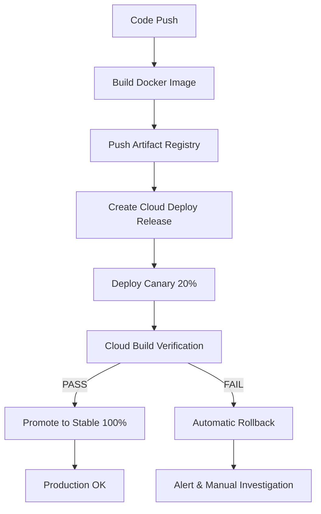

# Historique des Déploiements Cloud Run

Ce dossier contient l'historique chronologique des déploiements de l'application Emergence sur Google Cloud Run.

## 🚀 Architecture Canary Deployment - 2025-10-14

**Migration vers déploiement Canary automatisé avec Cloud Deploy**

- **Avant** : Conteneur unique sans canary (déploiement direct 100% trafic)
- **Maintenant** : Pipeline Cloud Deploy avec promotion automatique Canary → Stable
- **Workflow** :
  1. **Canary** : Déploiement 20% trafic + vérifications automatiques (health, metrics, smoke tests)
  2. **Validation** : Job Cloud Build exécute 6 étapes de vérification (timeout 10min)
  3. **Promotion** : Automatique vers 100% trafic si toutes les vérifications passent
  4. **Rollback** : Automatique en cas d'échec validation
- **Avantages** :
  - Détection précoce des problèmes (20% utilisateurs impactés max)
  - Validation automatisée pré-production (santé, métriques Prometheus, frontend)
  - Rollback sécurisé vers révision stable précédente
  - Traçabilité complète via Cloud Deploy
- **Documentation** : Voir section "Promotion Automatique Canary → Stable" ci-dessous

## Structure des Documents

Chaque déploiement est documenté avec :
- **Révision Cloud Run** et tag image Docker
- **Commits Git** inclus dans le déploiement
- **Résumé des changements** (features, fixes, optimisations)
- **Tests de validation** effectués
- **Processus de déploiement** (commandes Docker/gcloud)
- **Métriques** et impact (si applicable)
- **Points de vérification** post-déploiement

## Déploiements Récents

| Date | Révision | Image Tag | Description | Statut |
|------|----------|-----------|-------------|--------|
| 2025-10-10 | `emergence-app-p1-p0-20251010-040147` | `p1-p0-20251010-040147` | Phase P1.2 + P0 (préférences persistées + consolidation threads archivés) ([rapport](2025-10-10-deploy-p1-p0.md)) | ✅ Active (100%) |
| 2025-10-09 | `emergence-app-p1memory` | `deploy-p1-20251009-094822` | Phase P1 mémoire (queue async, préférences, instrumentation) ([rapport](2025-10-09-deploy-p1-memory.md)) | ✅ Active (100%) |
| 2025-10-09 | `emergence-app-phase3b` | `cockpit-phase3-20251009-073931` | Fix timeline SQL + redeploy cockpit Phase 3 ([rapport](2025-10-09-deploy-cockpit-phase3.md)) | ✅ Active (100%) |
| 2025-10-09 | `emergence-app-metrics001` | `deploy-20251008-183707` | Activation `CONCEPT_RECALL_METRICS_ENABLED` + routage 100 % (Prometheus Phase 3) ([rapport](2025-10-09-activation-metrics-phase3.md)) | ✅ Active (100%) |
| 2025-10-08 | `emergence-app-00275-2jb` | `deploy-20251008-183707` | Rebuild image Phases 2 & 3 + redeploy Cloud Run (health + metrics OK) ([rapport](2025-10-08-cloud-run-revision-00275.md)) | ⏸️ Archived |
| 2025-10-08 | `emergence-app-00274-m4w` | `deploy-20251008-121131` | **Phase 2 Performance** en production (neo_analysis, cache mémoire, débats parallèles) ([rapport](2025-10-08-cloud-run-revision-00274.md)) | ⏸️ Archived |
| 2025-10-08 | `emergence-app-00270-zs6` | `deploy-20251008-082149` | Cloud Run refresh (menu mobile confirmé) | ⏸️ Archived |
| 2025-10-08 | `emergence-app-00269-5qs` | `deploy-20251008-064424` | Cloud Run refresh (harmonisation UI cockpit/hymne) | ⏸️ Archived |
| 2025-10-06 | `emergence-app-00268-9s8` | `deploy-20251006-060538` | Agents & UI refresh (personnalités, module documentation, responsive) | ⏸️ Archived |
| 2025-10-05 | `emergence-app-00266-jc4` | `deploy-20251005-123837` | Corrections audit (13 fixes, score 87.5→95/100) | ⏸️ Archived |
| 2025-10-04 | `emergence-app-00265-xxx` | `deploy-20251004-205347` | Ajout système métriques + Settings module | ⏸️ Archived |

## Convention de Nommage

### Images Docker
Format : `deploy-YYYYMMDD-HHMMSS`
Exemple : `deploy-20251005-123837`

### Révisions Cloud Run
Format auto-généré : `emergence-app-00XXX-XXXXX`
Exemple : `emergence-app-00266-jc4`

### Documents
Format : `YYYY-MM-DD-description-courte.md`
Exemple : `2025-10-05-audit-fixes-deployment.md`

## Architecture de Déploiement

**Stratégie actuelle** : Pipeline Cloud Deploy avec Canary automatisé

- **Pipeline** : `emergence-pipeline` (2 stages: canary → stable)
- **Targets** :
  - `run-canary` : 20% trafic (nouvelle révision) + 80% stable
  - `run-stable` : 100% trafic (après validation)
- **Orchestration** : Skaffold + Cloud Deploy + Cloud Build
- **Vérifications** : Job Cloud Build automatique (6 étapes, timeout 10min)
- **Rollback** : Automatique vers révision stable précédente

### Workflow Complet



## Promotion Automatique Canary → Stable

### Pipeline Cloud Deploy

Le pipeline ÉMERGENCE utilise **Cloud Deploy** pour orchestrer le déploiement Canary avec promotion automatique.

**Fichiers de configuration** :
- [`clouddeploy.yaml`](../../clouddeploy.yaml) - Définition pipeline 2 stages
- [`targets.yaml`](../../targets.yaml) - Targets canary & stable
- [`skaffold.yaml`](../../skaffold.yaml) - Profiles canary/stable
- [`verify.yaml`](../../verify.yaml) - Job Cloud Build de vérification
- [`canary-service.yaml`](../../canary-service.yaml) - Manifeste Cloud Run canary (20%/80%)
- [`stable-service.yaml`](../../stable-service.yaml) - Manifeste Cloud Run stable (100%)

### Processus de Déploiement Automatisé

#### 1️⃣ Script PowerShell (Recommandé)

```powershell
# Déploiement complet automatisé
.\scripts\deploy.ps1

# Options disponibles
.\scripts\deploy.ps1 -SkipTests          # Sauter tests backend
.\scripts\deploy.ps1 -SkipBuild          # Sauter build Docker (utiliser image existante)
.\scripts\deploy.ps1 -ManualApproval     # Pas de confirmation interactive
.\scripts\deploy.ps1 -ImageTag "custom"  # Tag personnalisé (sinon timestamp auto)
```

**Étapes exécutées automatiquement** :
1. ✅ Vérifications pré-déploiement (gcloud, docker, auth)
2. 🧪 Tests backend (pytest + ruff + mypy) - optionnel
3. 🐳 Build Docker image (platform linux/amd64)
4. 📤 Push Artifact Registry
5. 🚀 Création Cloud Deploy release
6. 🔍 Déploiement Canary (20% trafic)
7. ⏳ Vérifications automatiques (Cloud Build job)
8. ✅ Promotion Stable (100% trafic)
9. 🎉 Vérification finale (health check)

#### 2️⃣ Ligne de Commande Manuelle

```bash
# 1. Build & Push
timestamp=$(date +%Y%m%d-%H%M%S)
image="europe-west1-docker.pkg.dev/emergence-469005/app/emergence-app:deploy-$timestamp"

docker build --platform linux/amd64 -t $image .
docker push $image

# 2. Create Cloud Deploy Release
gcloud deploy releases create rel-$timestamp \
  --project=emergence-469005 \
  --region=europe-west1 \
  --delivery-pipeline=emergence-pipeline \
  --skaffold-file=skaffold.yaml \
  --images=app=$image

# 3. Monitor (automatique)
gcloud deploy rollouts list \
  --delivery-pipeline=emergence-pipeline \
  --region=europe-west1
```

### Vérifications Automatiques (Cloud Build)

Le job [`verify.yaml`](../../verify.yaml) exécute 6 étapes de validation :

| Étape | Vérification | Critères PASS | Timeout |
|-------|--------------|---------------|---------|
| 1️⃣ | Wait for Ready | Révision Cloud Run ready | 30s |
| 2️⃣ | Health Check | `GET /api/health` → HTTP 200 + `"status":"ok"` | 2min (5 retry) |
| 3️⃣ | Readiness Check | `GET /health/readiness` → HTTP 200 | 30s |
| 4️⃣ | Metrics Validation | `GET /api/metrics` → Prometheus OK + `memory_analysis_failure_total ≤ 2` + Cache hit rate > 80% | 30s |
| 5️⃣ | Smoke Test | `GET /` (frontend) + `GET /assets/` → HTTP 200 | 30s |
| 6️⃣ | Validation Summary | Récapitulatif résultats | - |

**Critères bloquants** :
- ❌ Health check fail après 5 retry → **ROLLBACK**
- ❌ Readiness check fail → **ROLLBACK**
- ❌ Memory analysis failures > 2 → **ROLLBACK**
- ⚠️ Cache hit rate < 80% → **WARNING** (non-bloquant)
- ❌ Frontend inaccessible → **ROLLBACK**

**Timeout global** : 10 minutes (600s)

### Promotion Automatique

Si **toutes les vérifications passent** :
- Cloud Deploy déclenche automatiquement le stage `run-stable`
- Traffic split : **100%** → nouvelle révision (tag `stable`)
- Durée promotion : ~30-60 secondes
- Aucune action manuelle requise

**Règle automation** (définie dans `clouddeploy.yaml`) :
```yaml
automation:
  rules:
  - targetId: run-stable
    wait: "0s"  # Immediate promotion
    condition: "stages/0.rollouts/0/postdeploy/passed == true"
```

## Rollback Procédure

### Rollback Automatique

En cas d'échec des vérifications canary, le script [`scripts/rollback.ps1`](../../scripts/rollback.ps1) est déclenché automatiquement.

**Déclencheurs** :
- ❌ Cloud Build verification job fail
- ❌ Health check timeout
- ❌ Metrics validation fail

**Actions** :
1. Identification révision stable précédente
2. Bascule trafic 100% → révision précédente
3. Vérification santé post-rollback
4. Alerte équipe + logs

### Rollback Manuel

```powershell
# Rollback automatique vers dernière révision stable
.\scripts\rollback.ps1

# Rollback vers révision spécifique
.\scripts\rollback.ps1 -TargetRevision emergence-app-00298-g8j

# Dry run (simulation sans changement)
.\scripts\rollback.ps1 -DryRun

# Force (pas de confirmation)
.\scripts\rollback.ps1 -Force
```

**OU via gcloud CLI** :

```bash
# Lister révisions disponibles
gcloud run revisions list --service emergence-app \
  --region europe-west1 --project emergence-469005

# Rollback vers révision précédente
gcloud run services update-traffic emergence-app \
  --to-revisions=emergence-app-00XXX-yyy=100 \
  --region europe-west1 --project emergence-469005
```

### Monitoring Rollout

**Cloud Console** :
```
https://console.cloud.google.com/deploy/delivery-pipelines/europe-west1/emergence-pipeline?project=emergence-469005
```

**Logs en temps réel** :
```bash
# Logs Cloud Deploy
gcloud deploy rollouts describe <rollout-name> \
  --region=europe-west1 --project=emergence-469005

# Logs Cloud Build (verification job)
gcloud builds list --project=emergence-469005 --limit=5

# Logs Cloud Run
gcloud run services logs read emergence-app \
  --region=europe-west1 --project=emergence-469005 --limit=100
```


## Monitoring Post-Déploiement

### Logs Cloud Run
```bash
gcloud run services logs read emergence-app \
  --region europe-west1 --project emergence-469005 --limit 100
```

### Métriques
- **Prometheus** : https://emergence-app-486095406755.europe-west1.run.app/api/metrics
- **Health** : https://emergence-app-486095406755.europe-west1.run.app/health
- **Cloud Console** : https://console.cloud.google.com/run/detail/europe-west1/emergence-app

### Alertes à Surveiller
- Erreurs 5xx > 1% des requêtes
- Latence p95 > 2s
- Utilisation mémoire > 80%
- Cold start > 10s

## 📚 Documents Phase 2 & 3 (2025-10-08)

### Documentation Complète
- 📊 **[2025-10-08-phase2-perf.md](2025-10-08-phase2-perf.md)** - Phase 2 Optimisations Performance
- 📊 **[2025-10-08-phase2-logs-analysis.md](2025-10-08-phase2-logs-analysis.md)** - Analyse logs + fix OpenAI
- 📈 **[2025-10-08-phase3-monitoring.md](2025-10-08-phase3-monitoring.md)** - Phase 3 Métriques Prometheus
- 🎯 **[PHASES_RECAP.md](PHASES_RECAP.md)** - Récapitulatif Phases 2 & 3 + guide déploiement
- 🚀 **[../../CODEX_BUILD_DEPLOY_PROMPT.md](../../CODEX_BUILD_DEPLOY_PROMPT.md)** - Prompt Codex pour build/deploy

### Phase 2 : Optimisations Performance
1. **Agent neo_analysis** : GPT-4o-mini pour analyses mémoire (latence -43%, coût -40%)
2. **Cache in-memory** : Résumés sessions (TTL 1h, max 100 entrées)
3. **Débats parallèles** : Round 1 asyncio.gather (latence -40%)
4. **Fix OpenAI prompt** : Ajout mot "json" requis par API (nov 2024+)

### Phase 3 : Monitoring Prometheus
1. **13 métriques exposées** via `/api/metrics`
2. **5 types** : Success, Failure, Cache, Latency, Size
3. **Dashboards Grafana** suggérés (5 panels)
4. **Alertes** Prometheus configurables

### Commits Phase 2 & 3
- `611f06e` fix: prompt OpenAI neo_analysis - ajout mot 'json' requis par API
- `11ac853` feat(phase3): add Prometheus metrics for MemoryAnalyzer monitoring
- `dcffd45` docs: récapitulatif complet Phases 2 & 3 - guide déploiement
- `0ff5edd` docs: prompt complet pour Codex - build & deploy Phase 3

### Validation post-deploy
Chercher dans logs Cloud Run :
```bash
# Analyses mémoire avec neo_analysis (Phase 2)
gcloud logging read "jsonPayload.message=~'neo_analysis'" --limit 50

# Cache HIT/MISS (Phase 2)
gcloud logging read "jsonPayload.message=~'Cache (HIT|SAVED)'" --limit 50

# Métriques Prometheus (Phase 3)
curl https://[APP_URL]/api/metrics | grep memory_analysis
```

Métriques cibles :
- **Phase 2** : Latence analyses <4s, Cache hit >40%, neo_analysis 100% succès
- **Phase 3** : 13 métriques exposées, compteurs incrémentent, histogrammes OK

---

## Checklist Pré-Déploiement

- [ ] Tests backend passent (`pytest`)
- [ ] Tests frontend passent (`npm run build`)
- [ ] Documentation mise à jour (si changements d'API)
- [ ] Variables d'environnement vérifiées (.env.production)
- [ ] Secrets Cloud Run à jour (si nécessaire)
- [ ] Passation complétée ([docs/passation.md](../passation.md))
- [ ] AGENT_SYNC.md mis à jour
- [ ] Vérification : aucun autre service canary ou test actif

## Checklist Post-Déploiement

- [ ] Révision déployée avec succès (100% trafic)
- [ ] Vérification : un seul service `emergence-app` actif
- [ ] Vérification : maximum 3 révisions conservées
- [ ] Health check OK (`/health` returns 200)
- [ ] Logs sans erreurs critiques (5 premières minutes)
- [ ] Métriques Prometheus exposées (`/api/metrics`)
- [ ] Tests fumée endpoints critiques
- [ ] Document déploiement créé
- [ ] Passation mise à jour
- [ ] Notification équipe (si applicable)

---

**Projet** : Emergence V8
**Cloud Provider** : Google Cloud Platform
**Service** : Cloud Run (europe-west1)
**Registry** : Artifact Registry (europe-west1-docker.pkg.dev)
