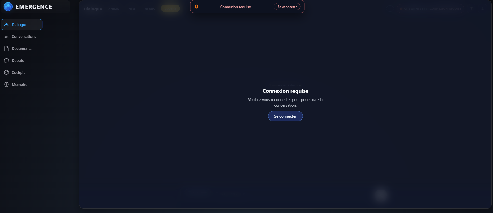
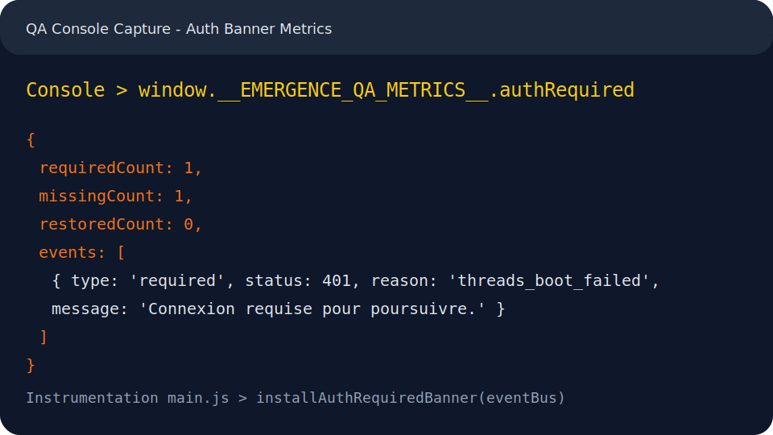

# Auth Required Banner QA

## Objectif
- Documenter l'instrumentation QA disponible via `window.__EMERGENCE_QA_METRICS__.authRequired`.
- Capturer l'etat console montrant le compteur `AUTH_REQUIRED` apres une erreur d'authentification sur `ensureCurrentThread()`.
*Note 2025-09-29 : la bannière visuelle est retirée (trace conservée via [AuthTrace]).*

## Declenchement
1. Demarrer le backend via `pwsh -File scripts/run-backend.ps1` (mode dev avec auth active).
2. Ouvrir l'interface web et forcer une deconnexion (vider le storage ou cliquer sur "Se deconnecter").
3. Rafraichir la page pour provoquer l'echec `ensureCurrentThread()` -> `AUTH_REQUIRED`.
4. Dans la console, executer `window.__EMERGENCE_QA_METRICS__.authRequired` pour afficher la derniere trace.

## Capture UI
*(Historique)* 

## Console QA

L'exemple stylise ci-dessus illustre :
- `requiredCount` incremente lors de l'emission `EVENTS.AUTH_REQUIRED`.
- `missingCount` suite a l'evenement `auth:missing`.
- Un evenement detaille (type, statut HTTP, raison, message) exploitable pour la QA manuelle.

## Notes
- Les evenements sont enregistres par `installAuthRequiredInstrumentation(eventBus)` dans `src/frontend/main.js`.
- Le compteur se reinitialise a chaque rechargement. Exporter la capture dans la PR de validation UI.
- Ajouter la capture a `docs/assets/ui/` pour conserver l'historique des parcours QA.
